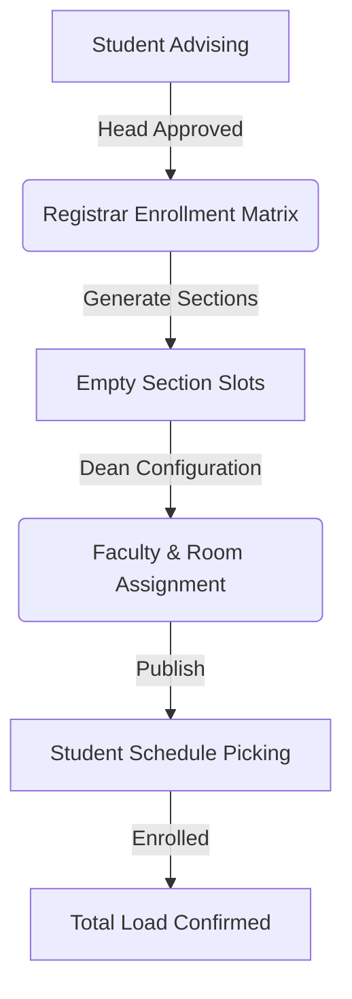

# System Flow: Sectioning & Scheduling

This document outlines the end-to-end process from student advising to final schedule publication.

## 1. High-Level Lifecycle

---

## 2. Component Roles

### 🏛️ Registrar (Phase 1: Sectioning)
- **Objective**: Determine how many physical sections are needed.
- **Tools**: Enrollment Matrix.
- **Process**: 
    - The Registrar views the total count of approved students per program/year.
    - They click **Generate Sections**, which creates the `Section` records and the required `Schedule` slots for every subject in the curriculum.
    - *Result*: The system creates "TBA" slots (e.g., *Subject: IT101, Section: BSIS 1-1, Prof: TBA, Room: TBA*).

### 🎓 Dean (Phase 2: Scheduling)
- **Objective**: Assign the right people to the right rooms at the right time.
- **Tools**: Scheduling Dashboard (Faculty Matrix & Section Blocks).
- **Process**:
    - The Dean toggles to **Section Blocks** to see which sections are `UNSCHEDULED`.
    - They set the **Days**, **Time**, **Room**, and **Professor**.
    - The system performs real-time **Conflict Checking** (Ensures no professor or room is double-booked).
    - *Result*: A fully configured timetable.

### 👥 Student (Phase 3: Picking)
- **Objective**: Finalize their own personal schedule.
- **Process**:
    - Once the Dean clicks **Publish**, students get a notification.
    - **Regular Students**: Pick a session (AM or PM). The system automatically assigns them to a section based on balance.
    - **Irregular Students**: Manually pick specific sections for each of their approved subjects.

---

## 3. Technical Logic Details

| Logic | Description |
| :--- | :--- |
| **Section Count** | `Ceil(Approved Students / 40)` |
| **Auto-Allocation** | Distributes subjects across M-T-W-TH-F-S sessions to minimize overlaps. |
| **Expertise Check** | Only professors with matching `ProfessorSubject` records appear in the Dean's picker by default. |
| **Conflict Guard** | Prevents overlapping `Schedule` records for the same `Professor` or `Room` within the same `Term`. |

> [!IMPORTANT]
> The **Publish** button is the point of no return. Once published, the schedule becomes visible to students and the enrollment period for schedule picking begins.
