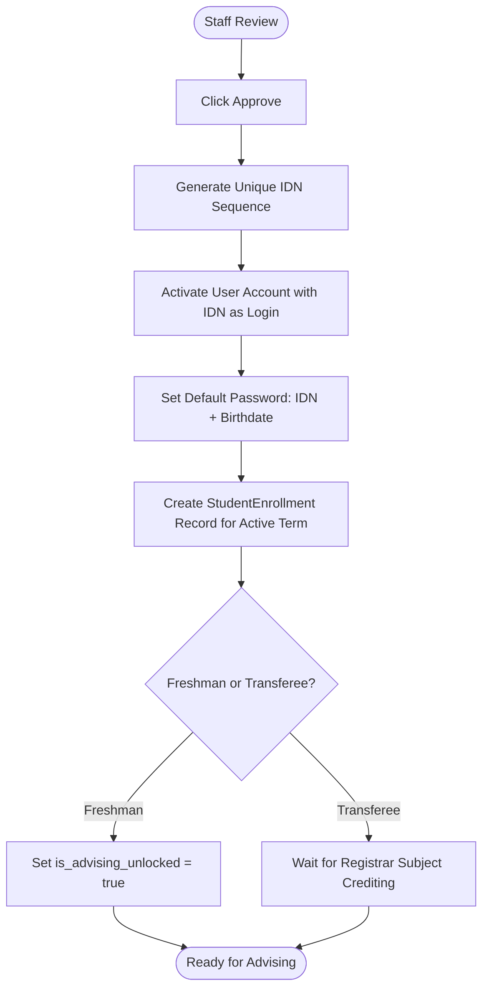

# Admission Approval Flowchart

Logical activation of students from `APPLICANT` status.

```mermaid
graph TD
    Start([Staff Review]) --> ApproveBtn[Click Approve]
    ApproveBtn --> IDNGen[Generate Unique IDN Sequence]
    
    IDNGen --> ActivateUser[Activate User Account with IDN as Login]
    ActivateUser --> SetPass[Set Default Password: IDN + Birthdate]
    
    SetPass --> CreateEnrollment[Create StudentEnrollment Record for Active Term]
    CreateEnrollment --> CheckType{Freshman or Transferee?}
    
    CheckType -- "Freshman" --> UnlockAdvising[Set is_advising_unlocked = true]
    CheckType -- "Transferee" --> PendingCredit[Wait for Registrar Subject Crediting]
    
    UnlockAdvising --> End([Ready for Advising])
    PendingCredit --> End
```
