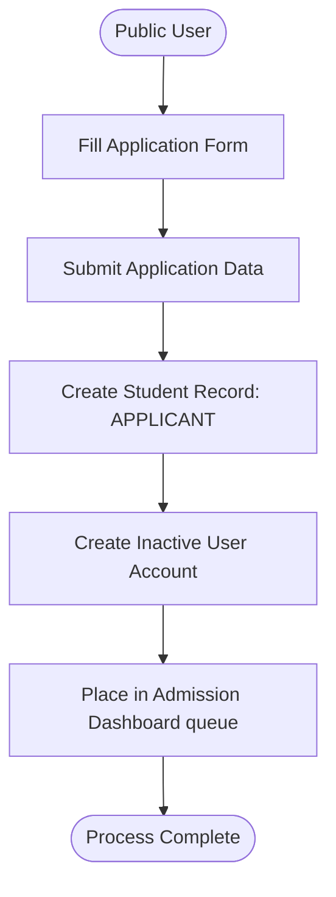
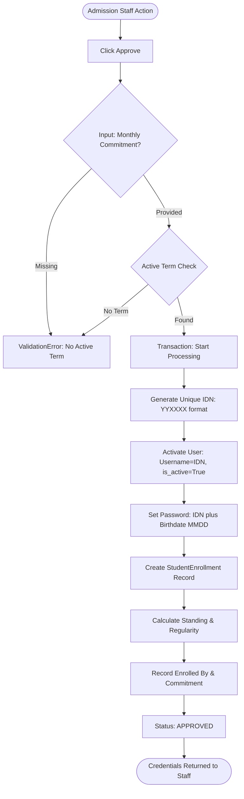
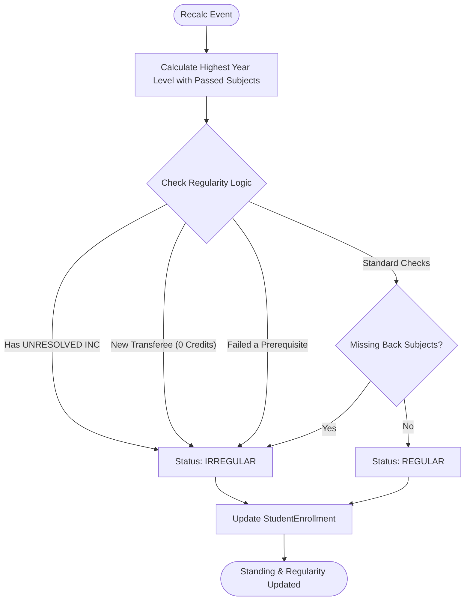

# Student & Admission Master Flow

The complete student lifecycle, from initial application to official standing.

## 1. Application & Admission
New applicants entering the system.

### A. Student Application

### B. Admission Approval (Logical Activation)

---

## 2. Academic Standing & Regularity
How the system determines year level and regularity status.

