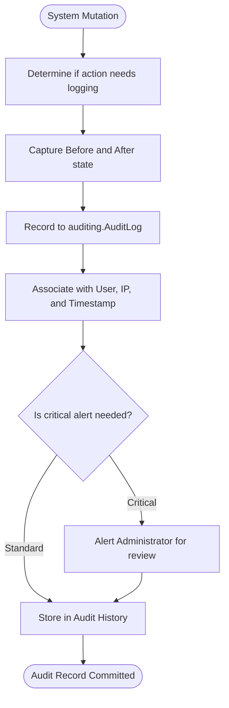

# Audit Logging Flowchart

Tracking critical changes for security and compliance.

```mermaid
graph TD
    Start([System Mutation]) --> CheckLogger[Determine if action needs logging]
    CheckLogger --> CaptureData[Capture Before and After state]
    
    CaptureData --> LogEvent[Record to auditing.AuditLog]
    LogEvent --> Metadata[Associate with User, IP, and Timestamp]
    
    Metadata --> AlertCheck{Is critical alert needed?}
    AlertCheck -- "Critical" --> NotifyAdmin[Alert Administrator for review]
    AlertCheck -- "Standard" --> Archive[Store in Audit History]
    
    NotifyAdmin --> Archive
    Archive --> End([Audit Record Committed])
```
