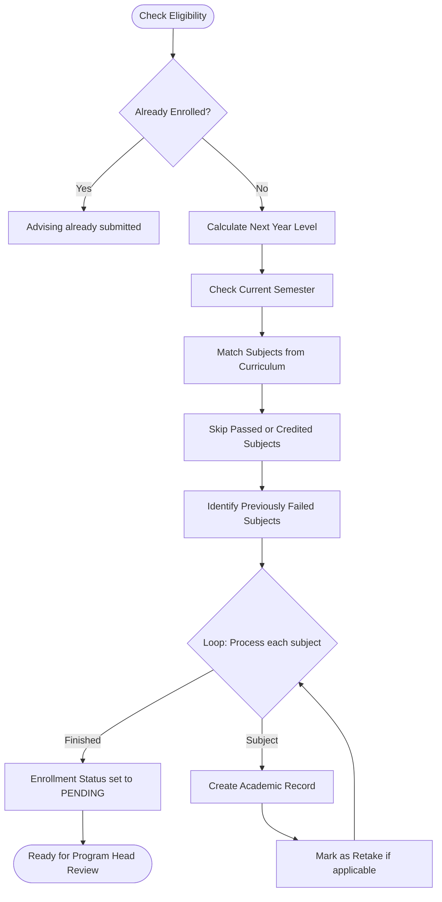

# Automatic Advising Flow (Regular Students)

Process for automatically assigning subjects to students in the next year level and semester.

```mermaid
graph TD
    Start([Check Eligibility]) --> CurrentEnrollment{Already Enrolled?}
    CurrentEnrollment -- "Yes" --> ShowError[Advising already submitted]
    CurrentEnrollment -- "No" --> CalcStatus[Calculate Next Year Level]
    
    CalcStatus --> GetSem[Check Current Semester]
    GetSem --> MatchSubjects[Match Subjects from Curriculum]
    
    MatchSubjects --> FilterPassed[Skip Passed or Credited Subjects]
    FilterPassed --> IdentifyRetakes[Identify Previously Failed Subjects]
    
    IdentifyRetakes --> LoopSubjects{Loop: Process each subject}
    LoopSubjects -- "Finished" --> SetPending[Enrollment Status set to PENDING]
    LoopSubjects -- "Subject" --> CreateGrade[Create Academic Record]
    
    CreateGrade --> SetRetakeFlag[Mark as Retake if applicable]
    SetRetakeFlag --> LoopSubjects
    
    SetPending --> End([Ready for Program Head Review])
```
