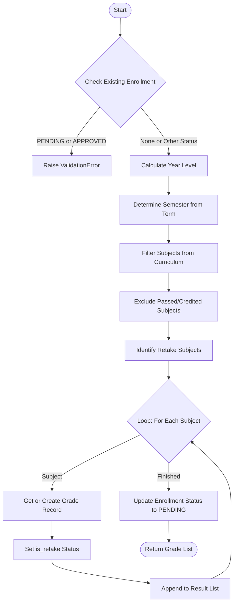

# auto_advise_regular Flowchart

```mermaid
graph TD
    Start([Start]) --> CheckEnrollment{Check Existing Enrollment}
    CheckEnrollment -- "PENDING or APPROVED" --> RaiseError[Raise ValidationError]
    CheckEnrollment -- "None or Other Status" --> GetYearLevel[Calculate Year Level]
    
    GetYearLevel --> GetSemester[Determine Semester from Term]
    GetSemester --> GetSubjects[Filter Subjects from Curriculum]
    
    GetSubjects --> ExcludePassed[Exclude Passed/Credited Subjects]
    ExcludePassed --> DetectRetakes[Identify Retake Subjects]
    
    DetectRetakes --> LoopStart{Loop: For Each Subject}
    LoopStart -- "Finished" --> UpdateEnrollment[Update Enrollment Status to PENDING]
    LoopStart -- "Subject" --> GetOrCreateGrade[Get or Create Grade Record]
    
    GetOrCreateGrade --> SetRetake[Set is_retake Status]
    SetRetake --> AppendGrade[Append to Result List]
    AppendGrade --> LoopStart
    
    UpdateEnrollment --> End([Return Grade List])
```
