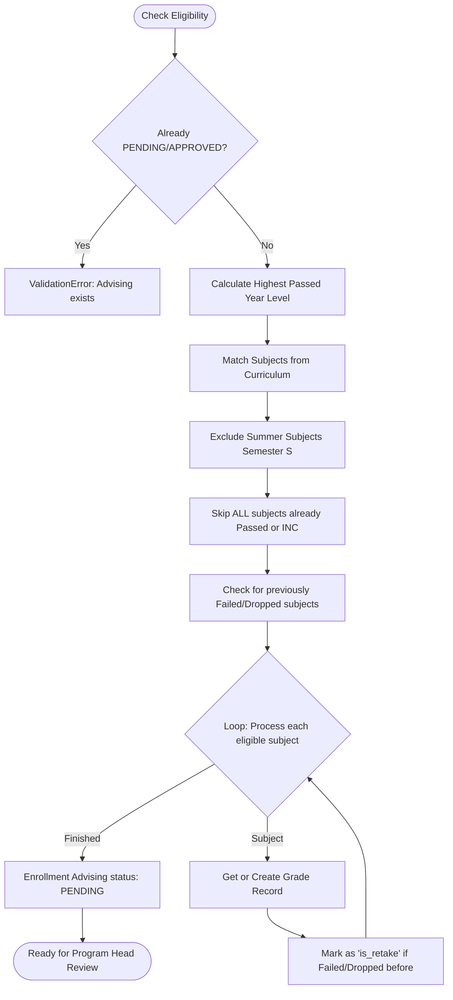
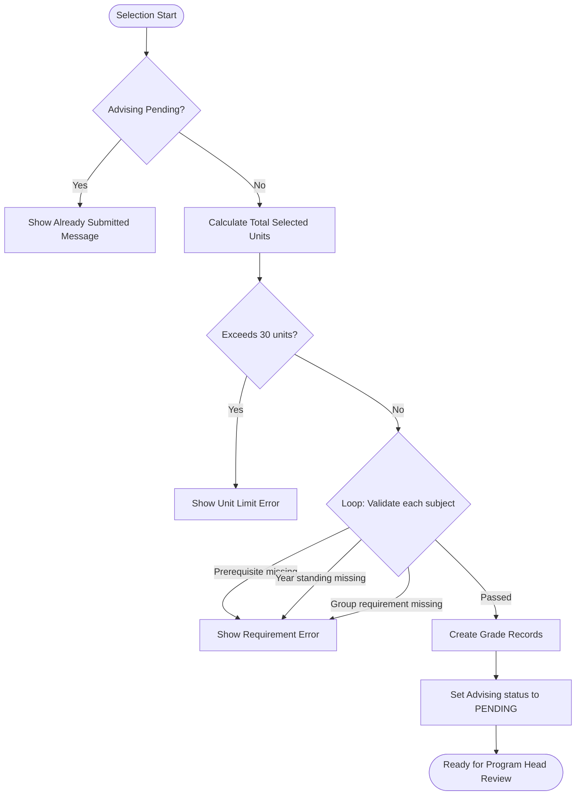
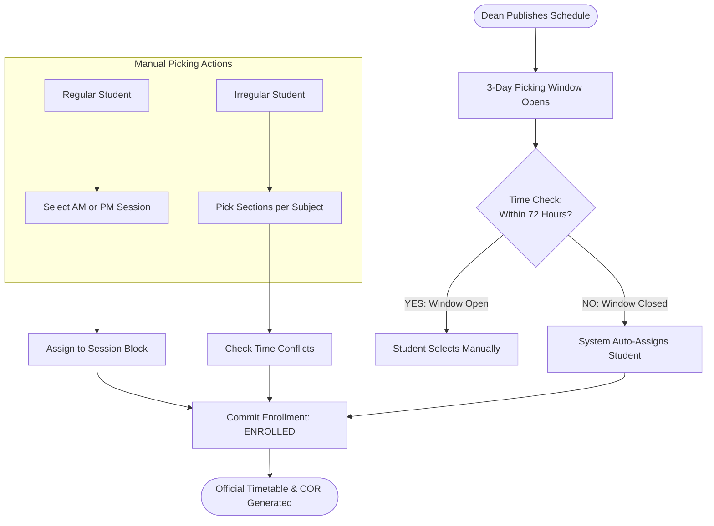

# Enrollment & Advising Master Flow

This document details the complete flow from subject selection to final enrollment.

## 1. Subject Advising (The "Plan")
Students must first plan their subjects for the term. This can be automatic or manual depending on the student's status.

### A. Automatic Advising (Regular Students)

### B. Manual Advising (Irregular Students)

---

## 2. Advising Approval (Staff Review)
Program Heads review the planned subjects before the student can proceed.

---

## 3. Schedule Selection (The Dynamic Window)
Once advising is approved and the Dean publishes the official schedule, the dynamic picking window opens.

> [!NOTE]
> **Automatic Assignment**: Students who do not pick their schedule within the 3-day window are automatically assigned to available sections by the system based on their regularity status and session history.
