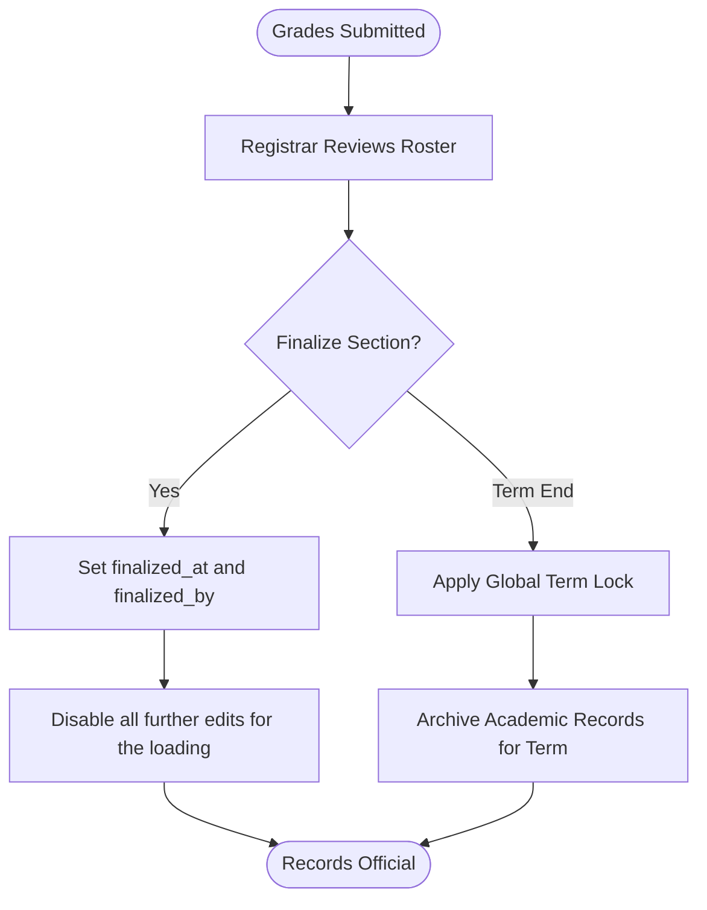

# Grade Finalization Flowchart

Registrar-level locking of academic records.

```mermaid
graph TD
    Start([Grades Submitted]) --> RegistrarReview[Registrar Reviews Roster]
    RegistrarReview --> FinalizeSection{Finalize Section?}
    
    FinalizeSection -- "Yes" --> ApplyLock[Set finalized_at and finalized_by]
    ApplyLock --> FreezeRecords[Disable all further edits for the loading]
    
    FinalizeSection -- "Term End" --> GlobalLock[Apply Global Term Lock]
    GlobalLock --> ArchiveRecords[Archive Academic Records for Term]
    
    FreezeRecords --> End([Records Official])
    ArchiveRecords --> End
```
