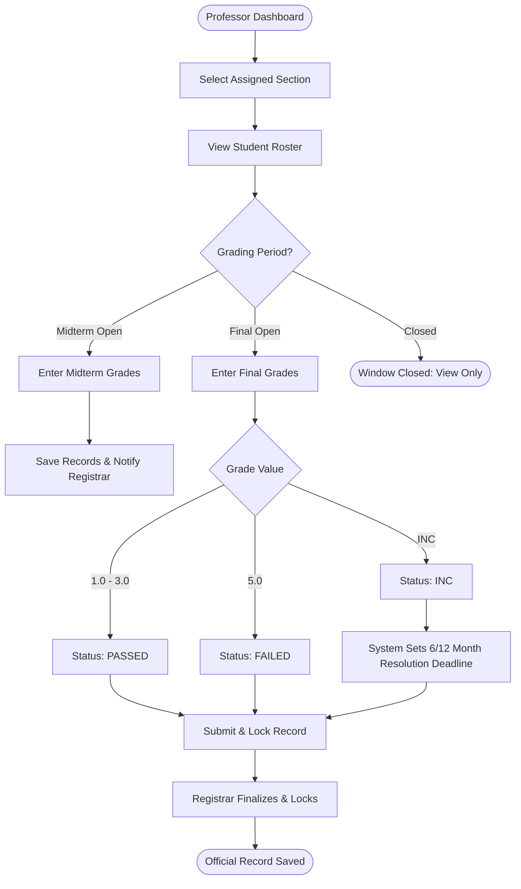
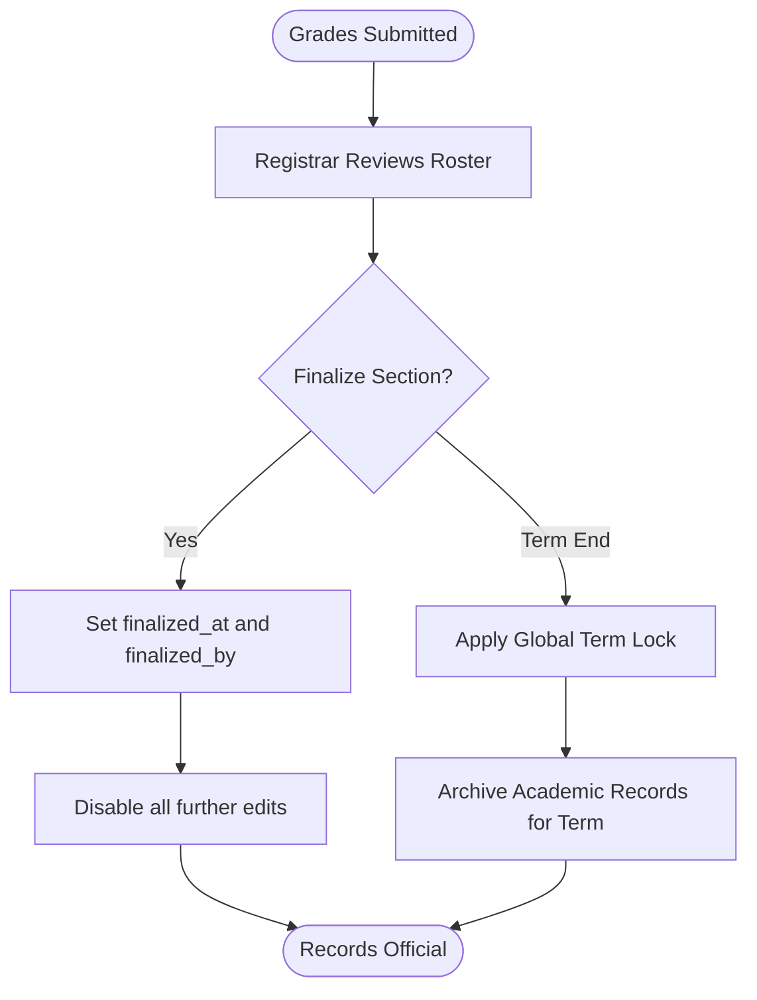
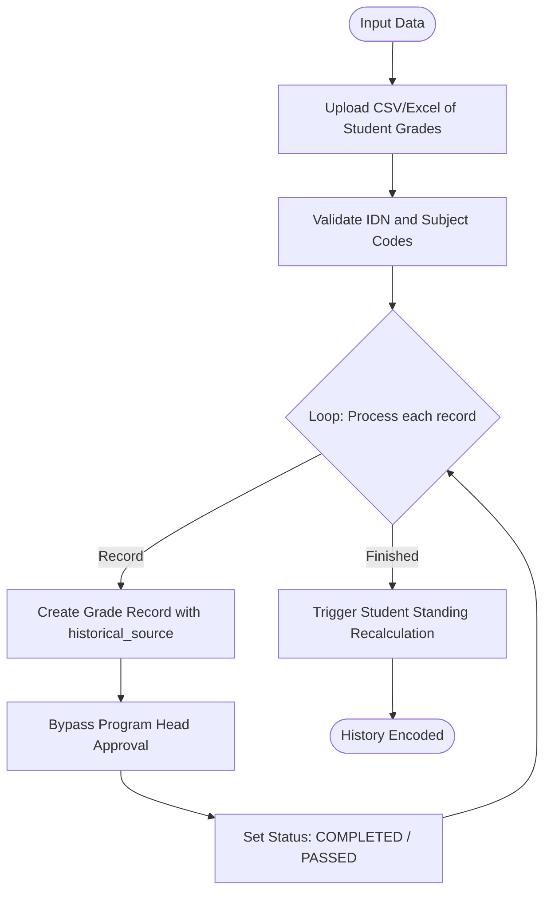
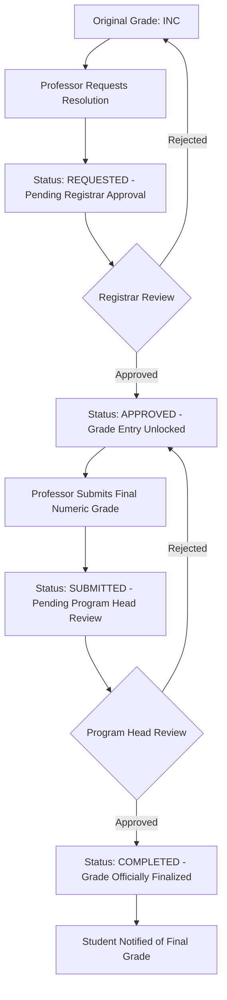

# Grading & Records Master Flow

Comprehensive guide for grade submission, finalization, and resolution management.

## 1. Grade Submission (Professor Step)
How professors record academic performance.

---

## 2. Grade Finalization & Historical Data
Registrar steps to lock records and encode TORs.

### A. Record Finalization

### B. Historical Encoding (Legacy Data)

---

## 3. INC Resolution Flow
Process for resolving Incomplete grades.

