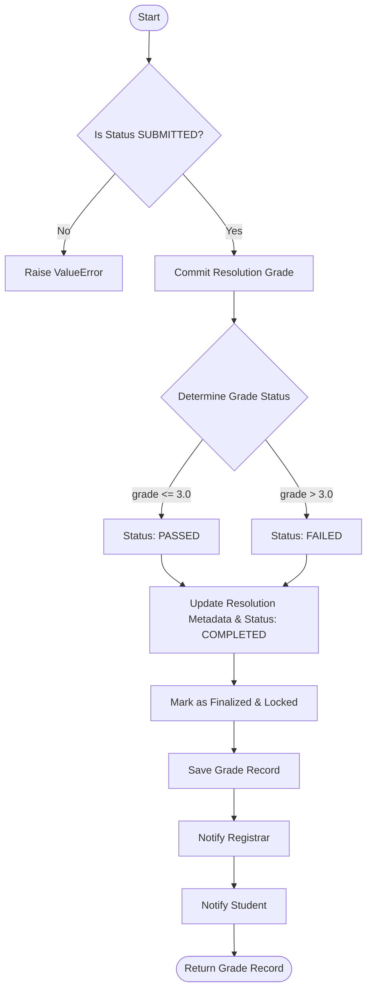

# head_approve_resolution Flowchart

```mermaid
graph TD
    Start([Start]) --> StatusCheck{Is Status SUBMITTED?}
    StatusCheck -- "No" --> RaiseStatusError[Raise ValueError]
    StatusCheck -- "Yes" --> CommitGrade[Commit Resolution Grade]
    
    CommitGrade --> StatusLogic{Determine Grade Status}
    StatusLogic -- "grade <= 3.0" --> Passed[Status: PASSED]
    StatusLogic -- "grade > 3.0" --> Failed[Status: FAILED]
    
    Passed --> SetMetadata[Update Resolution Metadata & Status: COMPLETED]
    Failed --> SetMetadata
    
    SetMetadata --> Finalize[Mark as Finalized & Locked]
    Finalize --> Save[Save Grade Record]
    
    Save --> NotifyRegistrar[Notify Registrar]
    NotifyRegistrar --> NotifyStudent[Notify Student]
    NotifyStudent --> End([Return Grade Record])
```
