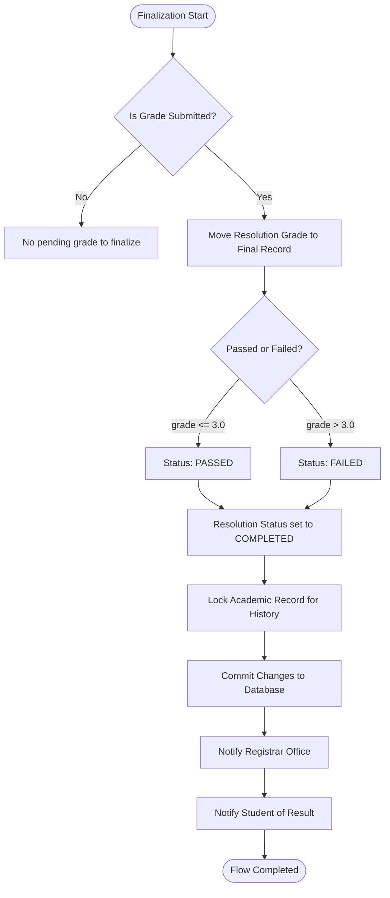

# INC Resolution Finalization Logic

Backend process for finalizing a submitted INC grade resolution.

```mermaid
graph TD
    Start([Finalization Start]) --> CheckSubmission{Is Grade Submitted?}
    CheckSubmission -- "No" --> StatusError[No pending grade to finalize]
    CheckSubmission -- "Yes" --> CopyGrade[Move Resolution Grade to Final Record]
    
    CopyGrade --> FinalStatus{Passed or Failed?}
    FinalStatus -- "grade <= 3.0" --> Passed[Status: PASSED]
    FinalStatus -- "grade > 3.0" --> Failed[Status: FAILED]
    
    Passed --> UpdateStatus[Resolution Status set to COMPLETED]
    Failed --> UpdateStatus
    
    UpdateStatus --> ApplyLock[Lock Academic Record for History]
    ApplyLock --> Save[Commit Changes to Database]
    
    Save --> NotifyRegistrar[Notify Registrar Office]
    NotifyRegistrar --> NotifyStudent[Notify Student of Result]
    NotifyStudent --> End([Flow Completed])
```
