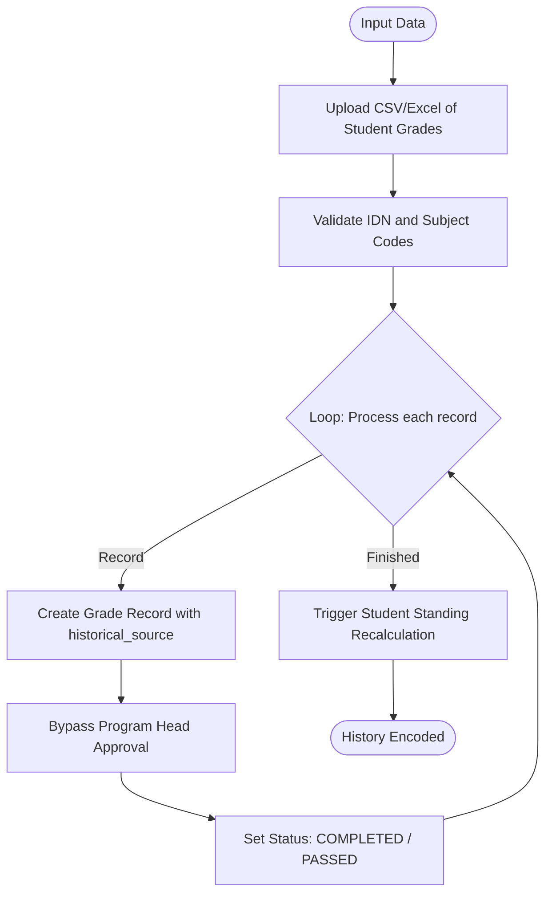

# Historical Encoding Flowchart

Service for registrars to bulk-upload legacy TOR data.

```mermaid
graph TD
    Start([Input Data]) --> BulkUpload[Upload CSV/Excel of Student Grades]
    BulkUpload --> ValidateRecords[Validate IDN and Subject Codes]
    
    ValidateRecords --> LoopRecords{Loop: Process each record}
    LoopRecords -- "Record" --> CreateGrade[Create Grade Record with historical_source]
    CreateGrade --> BypassApproval[Bypass Program Head Approval]
    BypassApproval --> SetStatus[Set Status: COMPLETED / PASSED]
    SetStatus --> LoopRecords
    
    LoopRecords -- "Finished" --> RecalcStanding[Trigger Student Standing Recalculation]
    RecalcStanding --> End([History Encoded])
```
