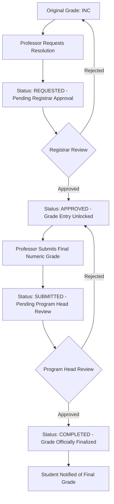
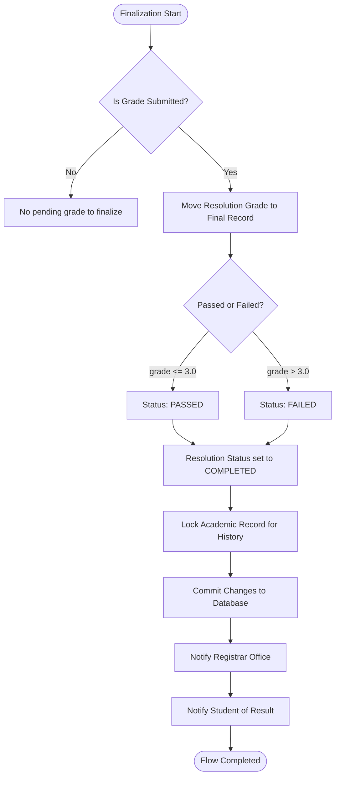

# INC Resolution: Complete Workflow

This guide covers both the Professor's steps and the Backend Finalization logic for resolving Incomplete (INC) grades.

## 1. Interaction Guide (Professor & Staff)
Process for requesting and submitting a resolution.

## 2. System Logic (Backend Finalization)
What happens internally when the Program Head gives the final approval.

