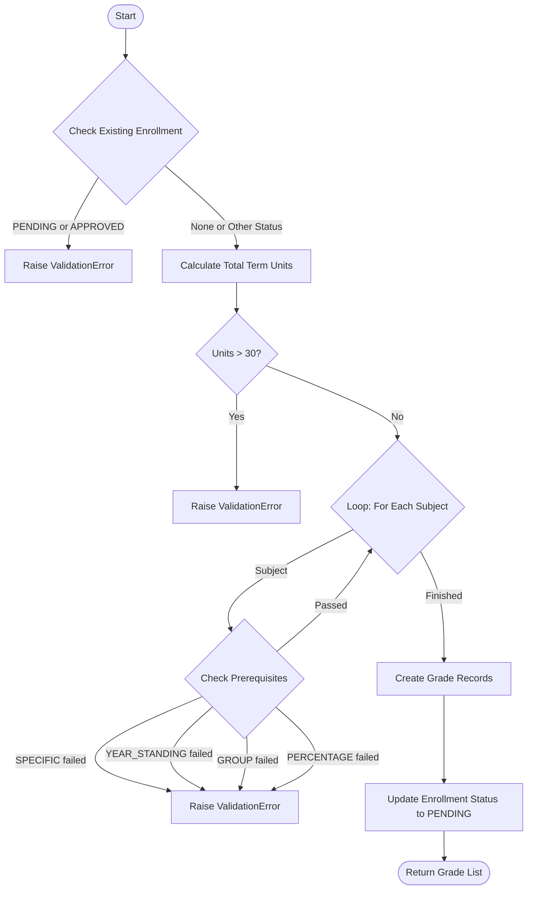

# manual_advise_irregular Flowchart

```mermaid
graph TD
    Start([Start]) --> CheckEnrollment{Check Existing Enrollment}
    CheckEnrollment -- "PENDING or APPROVED" --> RaiseError[Raise ValidationError]
    CheckEnrollment -- "None or Other Status" --> CalcUnits[Calculate Total Term Units]
    
    CalcUnits --> UnitCapCheck{Units > 30?}
    UnitCapCheck -- "Yes" --> RaiseUnitError[Raise ValidationError]
    UnitCapCheck -- "No" --> LoopPrereq{Loop: For Each Subject}
    
    LoopPrereq -- "Finished" --> CreateGrades[Create Grade Records]
    LoopPrereq -- "Subject" --> CheckPrereqs{Check Prerequisites}
    
    CheckPrereqs -- "SPECIFIC failed" --> RaisePrereqError[Raise ValidationError]
    CheckPrereqs -- "YEAR_STANDING failed" --> RaisePrereqError
    CheckPrereqs -- "GROUP failed" --> RaisePrereqError
    CheckPrereqs -- "PERCENTAGE failed" --> RaisePrereqError
    CheckPrereqs -- "Passed" --> LoopPrereq
    
    CreateGrades --> SetStatus[Update Enrollment Status to PENDING]
    SetStatus --> End([Return Grade List])
```
