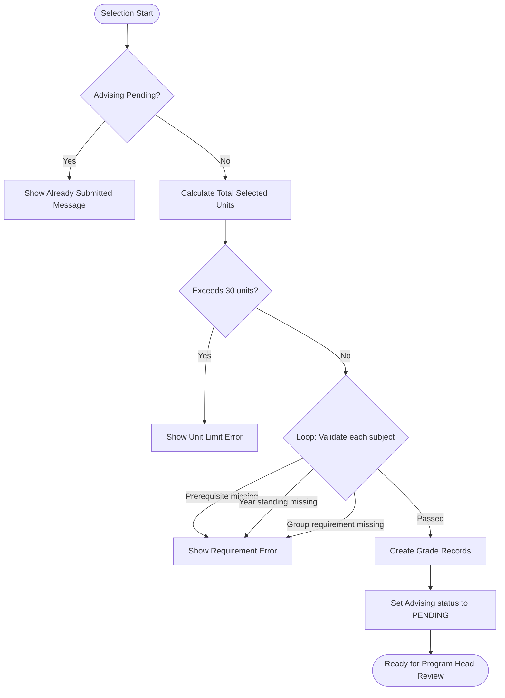

# Manual Advising Flow (Irregular Students)

Validation rules for students manually selecting their own subjects.

```mermaid
graph TD
    Start([Selection Start]) --> AlreadySubmitted{Advising Pending?}
    AlreadySubmitted -- "Yes" --> Error[Show Already Submitted Message]
    AlreadySubmitted -- "No" --> CalcUnits[Calculate Total Selected Units]
    
    CalcUnits --> UnitLimit{Exceeds 30 units?}
    UnitLimit -- "Yes" --> LimitError[Show Unit Limit Error]
    UnitLimit -- "No" --> CheckRules{Loop: Validate each subject}
    
    CheckRules -- "Prerequisite missing" --> RuleError[Show Requirement Error]
    CheckRules -- "Year standing missing" --> RuleError
    CheckRules -- "Group requirement missing" --> RuleError
    CheckRules -- "Passed" --> CreateRecords[Create Grade Records]
    
    CreateRecords --> UpdateStatus[Set Advising status to PENDING]
    UpdateStatus --> End([Ready for Program Head Review])
```
