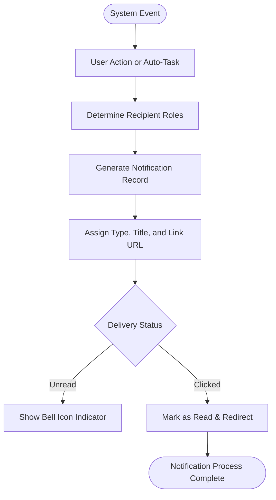

# Notification System Flowchart

Alerting users of system events.

```mermaid
graph TD
    Start([System Event]) --> ActionTrigger[User Action or Auto-Task]
    ActionTrigger --> IdentifyRecipient[Determine Recipient Roles]
    
    IdentifyRecipient --> CreateNotification[Generate Notification Record]
    CreateNotification --> SetMeta[Assign Type, Title, and Link URL]
    
    SetMeta --> DeliveryMode{Delivery Status}
    DeliveryMode -- "Unread" --> DashboardIndicator[Show Bell Icon Indicator]
    DeliveryMode -- "Clicked" --> MarkAsRead[Mark as Read & Redirect]
    
    MarkAsRead --> End([Notification Process Complete])
```
