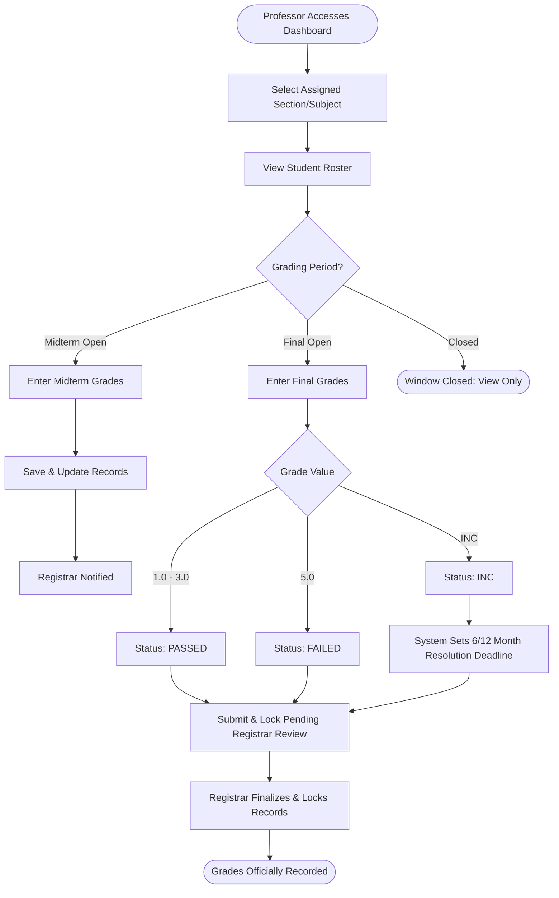

# Professor's Grading Guide (Flowchart)

This guide shows the process for submitting midterm and final grades.

```mermaid
graph TD
    Start([Professor Accesses Dashboard]) --> SelectSection[Select Assigned Section/Subject]
    SelectSection --> ViewRoster[View Student Roster]
    
    ViewRoster --> GradingPeriod{Grading Period?}
    GradingPeriod -- "Midterm Open" --> EnterMidterm[Enter Midterm Grades]
    GradingPeriod -- "Final Open" --> EnterFinal[Enter Final Grades]
    GradingPeriod -- "Closed" --> WindowClosed([Window Closed: View Only])
    
    EnterMidterm --> SaveMidterm[Save & Update Records]
    SaveMidterm --> NotifyRegistrar[Registrar Notified]
    
    EnterFinal --> FinalStatus{Grade Value}
    FinalStatus -- "1.0 - 3.0" --> Passed[Status: PASSED]
    FinalStatus -- "5.0" --> Failed[Status: FAILED]
    FinalStatus -- "INC" --> INC[Status: INC]
    
    INC --> SetDeadline[System Sets 6/12 Month Resolution Deadline]
    
    Passed --> SubmitFinal[Submit & Lock Pending Registrar Review]
    Failed --> SubmitFinal
    SetDeadline --> SubmitFinal
    
    SubmitFinal --> Finalize[Registrar Finalizes & Locks Records]
    Finalize --> End([Grades Officially Recorded])
```
