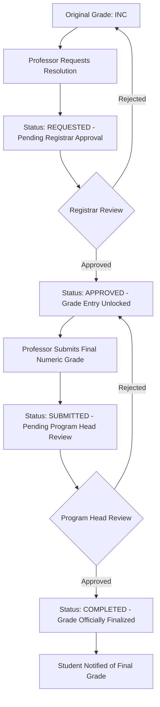

# INC Resolution Guide for Professors

Process for resolving "Incomplete" (INC) grades after the term has ended.

```mermaid
graph TD
    INC[Original Grade: INC] --> ProfessorRequest[Professor Requests Resolution]
    ProfessorRequest --> Requested[Status: REQUESTED - Pending Registrar Approval]
    
    Requested --> RegistrarReview{Registrar Review}
    RegistrarReview -- "Rejected" --> INC
    RegistrarReview -- "Approved" --> Approved[Status: APPROVED - Grade Entry Unlocked]
    
    Approved --> EnterNumeric[Professor Submits Final Numeric Grade]
    EnterNumeric --> Submitted[Status: SUBMITTED - Pending Program Head Review]
    
    Submitted --> PHReview{Program Head Review}
    PHReview -- "Rejected" --> Approved
    PHReview -- "Approved" --> Finalized[Status: COMPLETED - Grade Officially Finalized]
    
    Finalized --> NotifyStudent[Student Notified of Final Grade]
```
