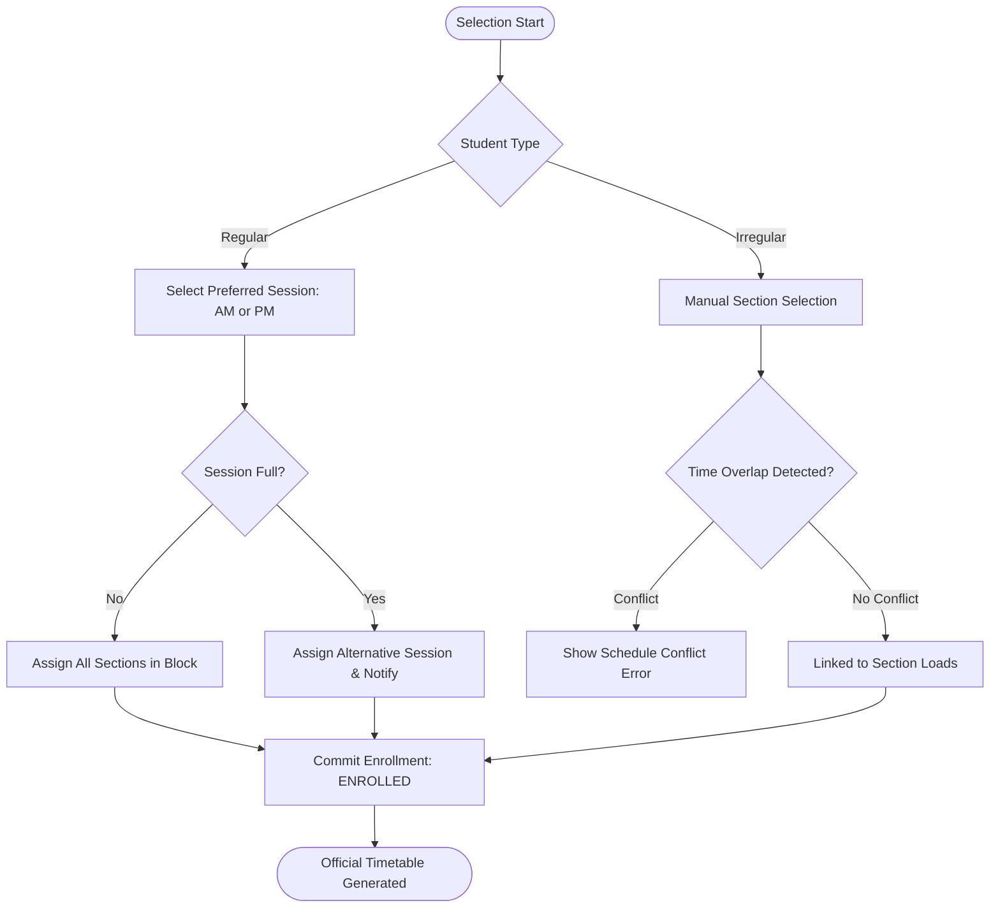

# Schedule Picking Flowchart

Process for selecting class sections and managing session loads.

#### Backend Reference
- Handled by `PickingService`.
- **Session Fallback**: Regular students who find their preferred session full are automatically moved to the alternative session to ensure enrollment continuity.
