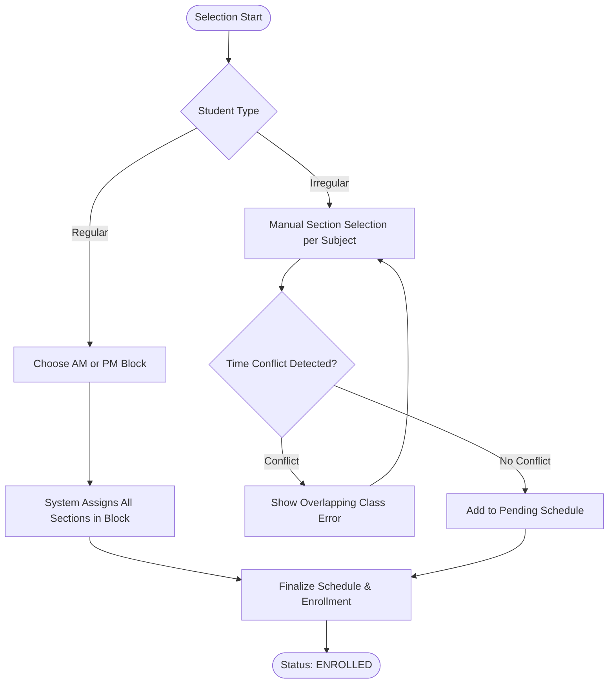

# Schedule Picking Flowchart

Logic for selecting sections and detecting conflicts.

```mermaid
graph TD
    Start([Selection Start]) --> StudentType{Student Type}
    
    StudentType -- "Regular" --> BlockSelect[Choose AM or PM Block]
    BlockSelect --> AutoAssign[System Assigns All Sections in Block]
    
    StudentType -- "Irregular" --> SectionSelect[Manual Section Selection per Subject]
    SectionSelect --> ConflictCheck{Time Conflict Detected?}
    ConflictCheck -- "Conflict" --> ShowConflict[Show Overlapping Class Error]
    ShowConflict --> SectionSelect
    ConflictCheck -- "No Conflict" --> AddToSched[Add to Pending Schedule]
    
    AutoAssign --> Finalize[Finalize Schedule & Enrollment]
    AddToSched --> Finalize
    
    Finalize --> End([Status: ENROLLED])
```
