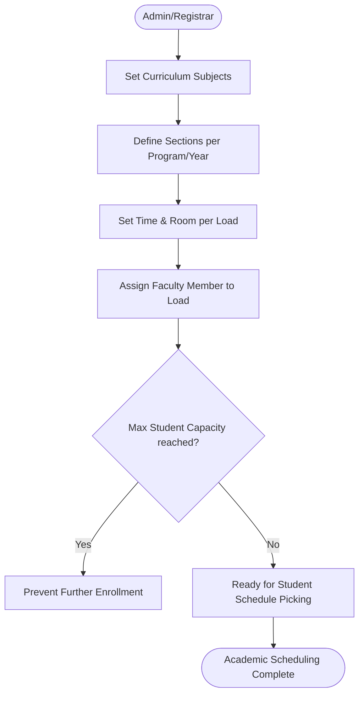

# Scheduling System Flowchart

Managing linkage between Rooms, Sections, and Loads.

```mermaid
graph TD
    Start([Admin/Registrar]) --> DefineCurriculum[Set Curriculum Subjects]
    DefineCurriculum --> CreateSections[Define Sections per Program/Year]
    
    CreateSections --> AssignSchedules[Set Time & Room per Load]
    AssignSchedules --> AssignInstructor[Assign Faculty Member to Load]
    
    AssignInstructor --> CapacityCheck{Max Student Capacity reached?}
    CapacityCheck -- "Yes" --> ShowWarning[Prevent Further Enrollment]
    CapacityCheck -- "No" --> AllowEnroll[Ready for Student Schedule Picking]
    
    AllowEnroll --> End([Academic Scheduling Complete])
```
