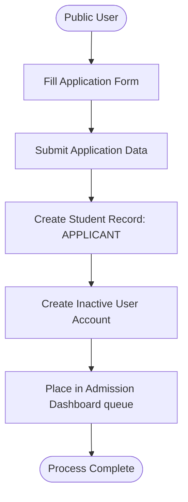

# Student Application Flowchart

Public application process at `/apply`.

```mermaid
graph TD
    Start([Public User]) --> FillForm[Fill Application Form]
    FillForm --> Submit[Submit Application Data]
    
    Submit --> CreateRecord[Create Student Record: APPLICANT]
    CreateRecord --> InactiveUser[Create Inactive User Account]
    InactiveUser --> PendingReview[Place in Admission Dashboard queue]
    
    PendingReview --> End([Process Complete])
```
