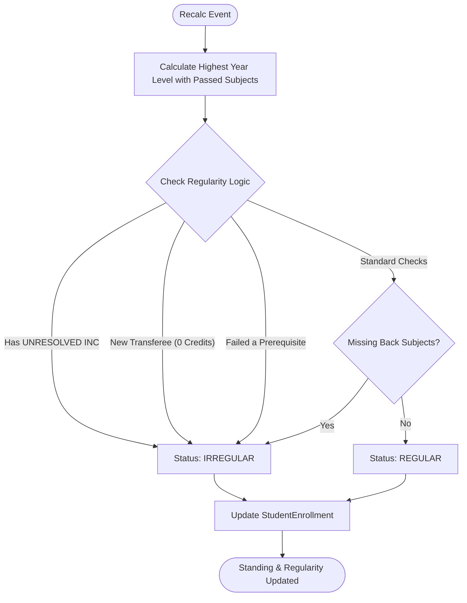

# Student Standing Recalculation Flowchart

Logic for calculating year level and determining if a student is "Regular".

#### Regularity Rules (Backend)
- **Back Subjects**: Subjects from previous years or previous semesters that have not been passed.
- **Prerequisites**: Failing a subject that blocks other subjects immediately flags the student as irregular.
- **Transferees**: Start as irregular by default until their previous credits are encoded in the system.
