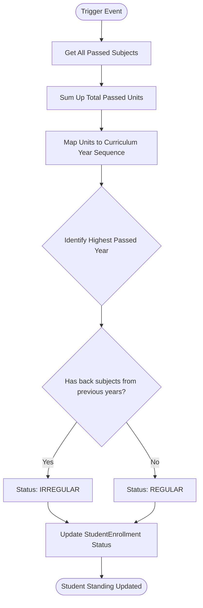

# Student Standing Recalculation Flowchart

Logic for calculating year level and regularity.

```mermaid
graph TD
    Start([Trigger Event]) --> GetPassed[Get All Passed Subjects]
    GetPassed --> CalcUnits[Sum Up Total Passed Units]
    
    CalcUnits --> MapYearLevel[Map Units to Curriculum Year Sequence]
    MapYearLevel --> HighestYear{Identify Highest Passed Year}
    
    HighestYear --> RegularityCheck{Has back subjects from previous years?}
    RegularityCheck -- "Yes" --> SetIrregular[Status: IRREGULAR]
    RegularityCheck -- "No" --> SetRegular[Status: REGULAR]
    
    SetIrregular --> SaveStanding[Update StudentEnrollment Status]
    SetRegular --> SaveStanding
    
    SaveStanding --> End([Student Standing Updated])
```
