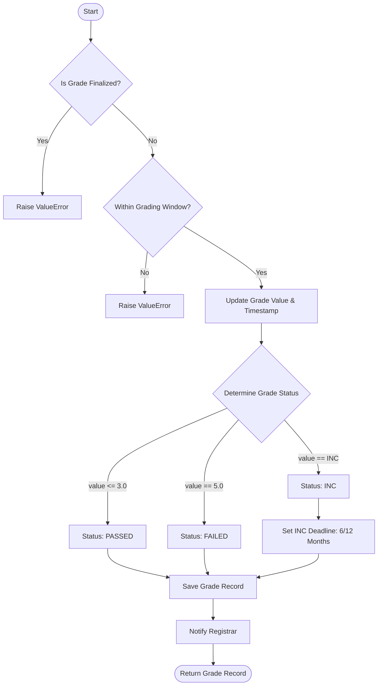

# submit_final Flowchart

```mermaid
graph TD
    Start([Start]) --> LockCheck{Is Grade Finalized?}
    LockCheck -- "Yes" --> RaiseLockError[Raise ValueError]
    LockCheck -- "No" --> WindowCheck{Within Grading Window?}
    
    WindowCheck -- "No" --> RaiseWindowError[Raise ValueError]
    WindowCheck -- "Yes" --> SetGrade[Update Grade Value & Timestamp]
    
    SetGrade --> StatusLogic{Determine Grade Status}
    StatusLogic -- "value <= 3.0" --> Passed[Status: PASSED]
    StatusLogic -- "value == 5.0" --> Failed[Status: FAILED]
    StatusLogic -- "value == INC" --> INC[Status: INC]
    
    INC --> SetDeadline[Set INC Deadline: 6/12 Months]
    
    Passed --> Save[Save Grade Record]
    Failed --> Save
    SetDeadline --> Save
    
    Save --> NotifyRegistrar[Notify Registrar]
    NotifyRegistrar --> End([Return Grade Record])
```
