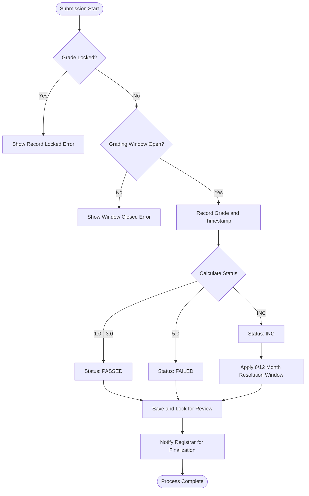

# Grade Submission System Logic

Detailed logic for processing final grade submissions.

```mermaid
graph TD
    Start([Submission Start]) --> Finalized{Grade Locked?}
    Finalized -- "Yes" --> LockError[Show Record Locked Error]
    Finalized -- "No" --> WindowCheck{Grading Window Open?}
    
    WindowCheck -- "No" --> WindowError[Show Window Closed Error]
    WindowCheck -- "Yes" --> UpdateRecord[Record Grade and Timestamp]
    
    UpdateRecord --> GradingScale{Calculate Status}
    GradingScale -- "1.0 - 3.0" --> Passed[Status: PASSED]
    GradingScale -- "5.0" --> Failed[Status: FAILED]
    GradingScale -- "INC" --> Incomplete[Status: INC]
    
    Incomplete --> CalcDeadline[Apply 6/12 Month Resolution Window]
    
    Passed --> Save[Save and Lock for Review]
    Failed --> Save
    CalcDeadline --> Save
    
    Save --> Notify[Notify Registrar for Finalization]
    Notify --> End([Process Complete])
```
