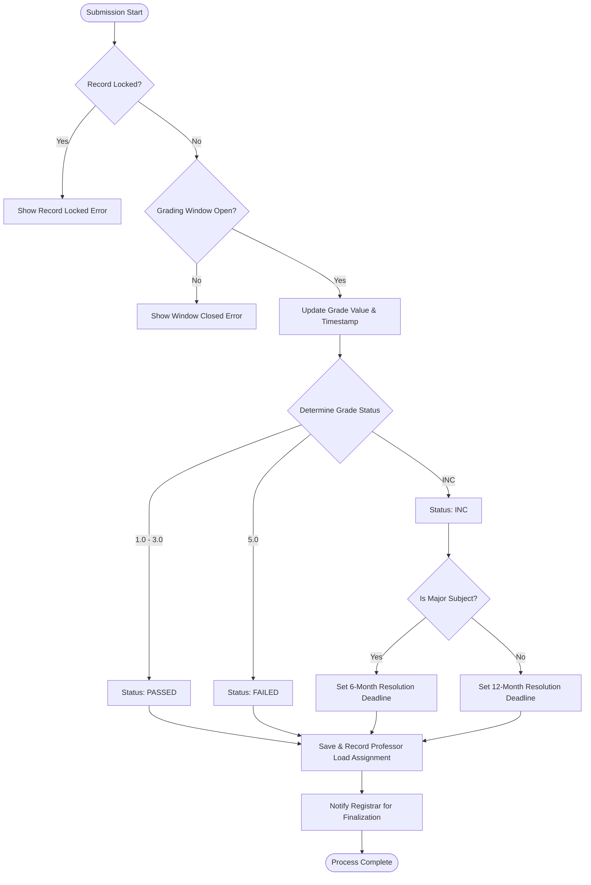

# Grade Submission System Logic

Detailed logic for processing final grade submissions.

#### Backend Reference
- Handled by `GradingService.submit_final`.
- **INC Policy**: The system automatically differentiates between major and minor subjects for the resolution window.
