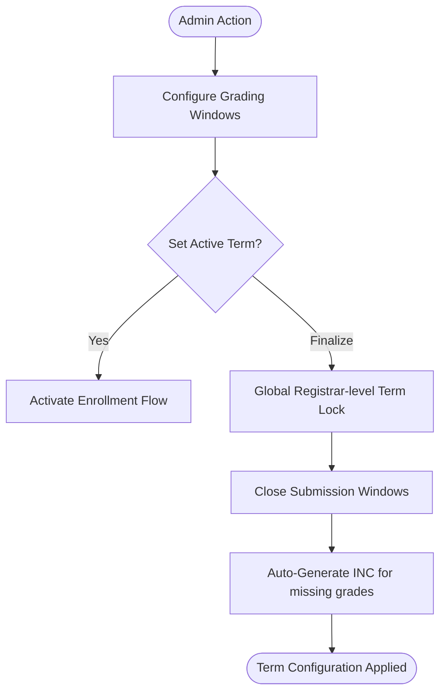
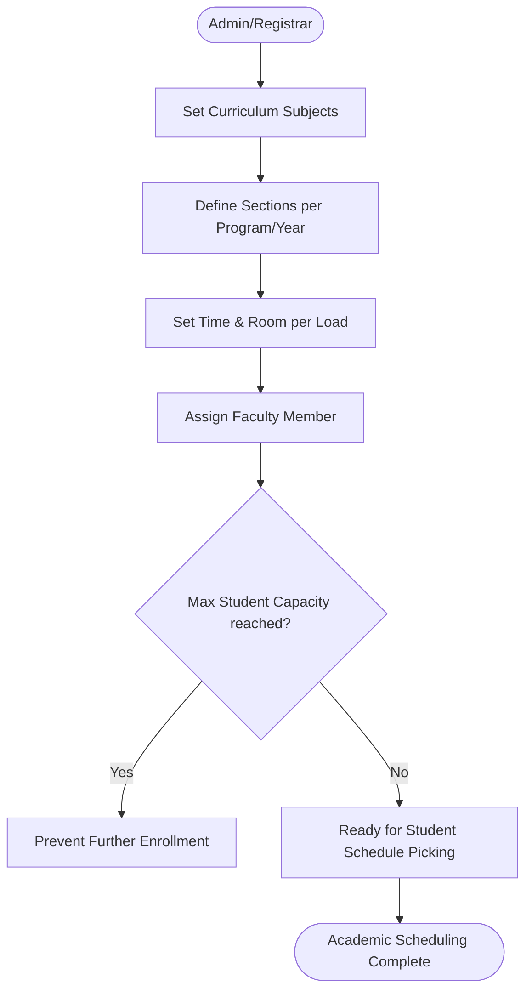
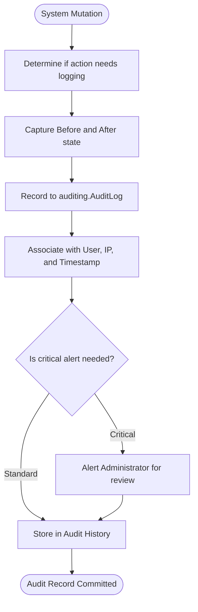
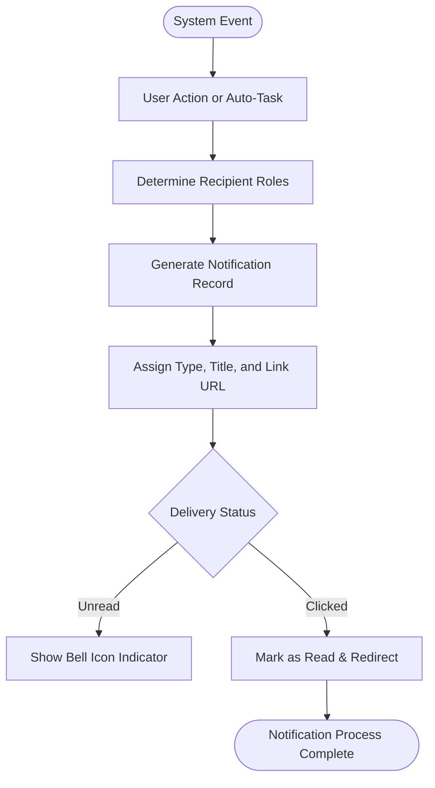

# System Infrastructure Master Flow

Background services and administrative control flows.

## 1. Term & Schedule Management
Core structural management of the academic calendar.

### A. Term Management

### B. Scheduling System

---

## 2. Core Services (Audit & Alerts)
System-wide utilities for monitoring and communication.

### A. Audit Logging

### B. Notification System

