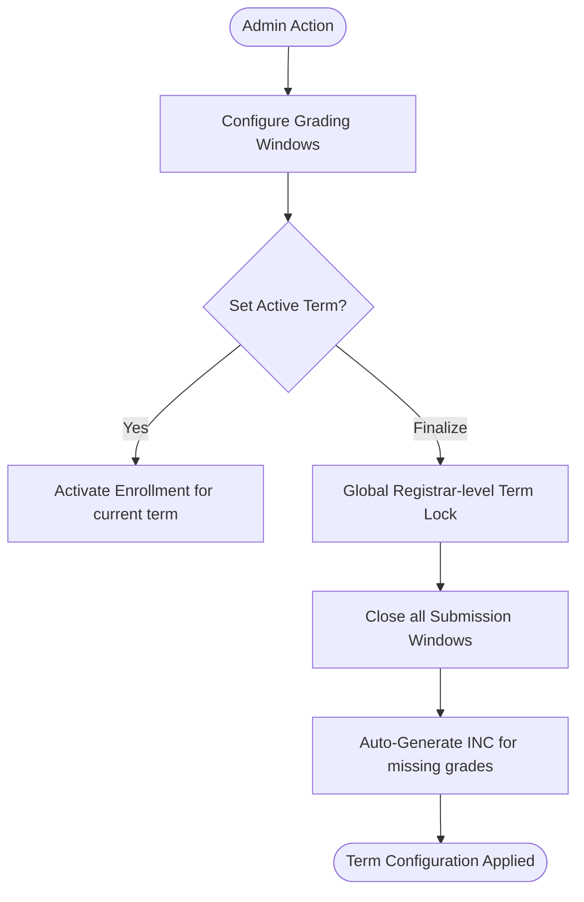

# Term Management Flowchart

Controlling term activation and window closure.

```mermaid
graph TD
    Start([Admin Action]) --> TermConfig[Configure Grading Windows]
    TermConfig --> SetActive{Set Active Term?}
    
    SetActive -- "Yes" --> ActivateFlow[Activate Enrollment for current term]
    SetActive -- "Finalize" --> TermLock[Global Registrar-level Term Lock]
    
    TermLock --> CloseWindows[Close all Submission Windows]
    CloseWindows --> GenerateINC[Auto-Generate INC for missing grades]
    
    GenerateINC --> End([Term Configuration Applied])
```
