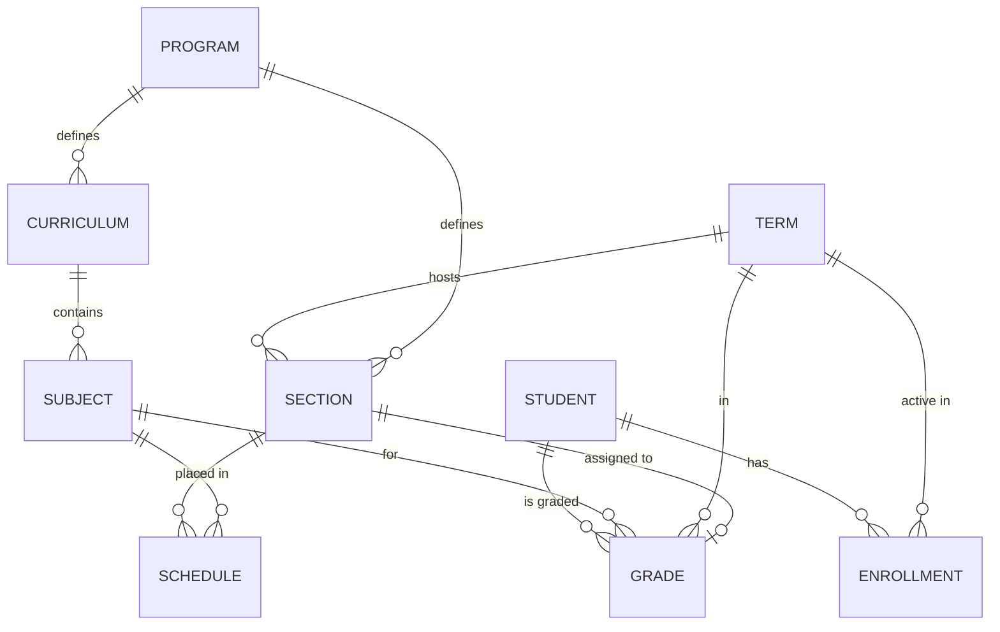

# Data Model Overview

## Core Relationships

## Key Modules

### Academics
- **Program**: Academic degrees (BSIS, BSAIS).
- **Subject**: Individual courses with units and year levels.

### Students
- **Student**: Profile data (name, idn, type).
- **StudentEnrollment**: Link between student and term; tracks regularity status.

### Scheduling
- **Section**: A group of students in a specific year level and term.
- **Schedule**: A mapping of (Subject, Section, Professor, Room, Time).

### Grades
- **Grade**: Central record for a student's performance in a subject. 
- Tracks `midterm_grade`, `final_grade`, and `resolution_status` for INCs.
