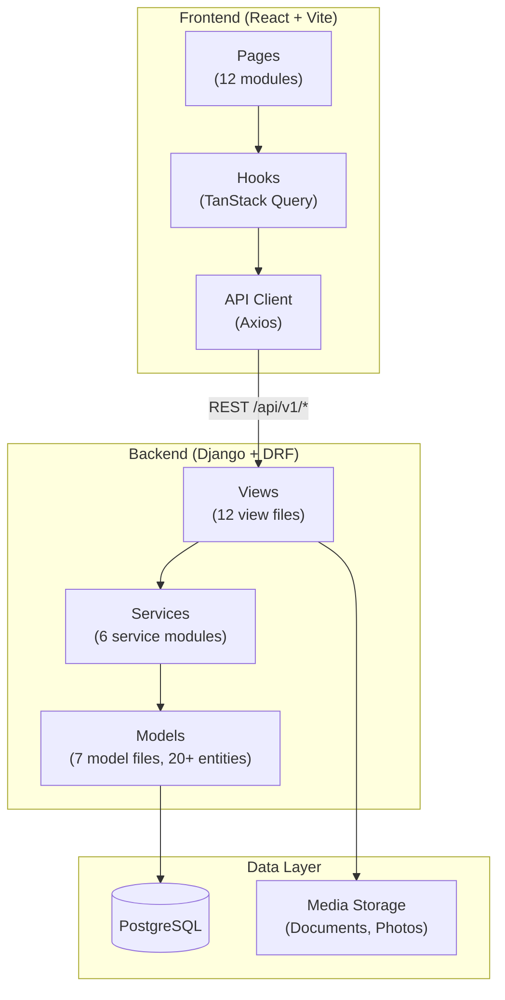

# Richwell Colleges Portal — System Overview

## 1. Project Summary

**Richwell Colleges Portal** is a full-stack web application for managing the complete enrollment lifecycle of a Philippine college. It handles online admissions, subject enrollment, payment tracking, grade management, document release, and reporting — all under a role-based access control system with 8 distinct user roles.

**Target Users:** Students, Professors, Cashiers, Registrars, Admission Staff, Department Heads, Head Registrar, and System Administrators.

---

## 2. Technology Stack

| Layer | Technology | Version |
|-------|-----------|---------|
| **Frontend Framework** | React | 18.x |
| **Build Tool** | Vite | 5.x |
| **Styling** | Tailwind CSS | 3.x |
| **State / Data Fetching** | TanStack Query (React Query) | 5.x |
| **Routing** | React Router | 6.x |
| **Icons** | Lucide React | — |
| **Animations** | Framer Motion | — |
| **Backend Framework** | Django | 5.x |
| **API Layer** | Django REST Framework (DRF) | 3.15+ |
| **Authentication** | JWT (SimpleJWT) | — |
| **Database** | PostgreSQL | 15+ |
| **API Documentation** | drf-spectacular (OpenAPI 3) | — |
| **PDF Generation** | html2pdf.js (client), WeasyPrint concepts (server) | — |

---

## 3. High-Level Architecture

---

## 4. Application Modules

The backend is organized into **5 Django apps**, each responsible for a distinct domain:

| App | Namespace | Purpose |
|-----|-----------|---------|
| `accounts` | `/api/v1/accounts/` | Authentication, user management, student profiles, staff management |
| `academics` | `/api/v1/academics/` | Programs, subjects, sections, schedules, rooms, curricula |
| `enrollment` | `/api/v1/admissions/` | Enrollment lifecycle, subject enrollment, payments, grades, exams, documents, reports |
| `audit` | `/api/v1/audit/` | Immutable audit logs, dashboard alerts |
| `core` | `/api/v1/core/` | System configuration, notifications |

---

## 5. Key Endpoints

| Path | Description |
|------|-------------|
| `/` | Health check (JSON) |
| `/admin/` | Django admin panel |
| `/api/v1/` | API root (all endpoints below) |
| `/api/docs/` | Swagger UI (interactive API documentation) |
| `/api/redoc/` | ReDoc (alternative API docs) |
| `/api/schema/` | OpenAPI 3 schema (JSON/YAML) |

---

## 6. User Roles

| Role | Code | Primary Responsibility |
|------|------|----------------------|
| Student | `STUDENT` | View enrollment, grades, schedule, payments; enroll in subjects |
| Professor | `PROFESSOR` | Submit grades, view assigned sections, initiate grade resolutions |
| Cashier | `CASHIER` | Record payments, manage promissory notes, generate exam permits |
| Registrar | `REGISTRAR` | Manage students, finalize grades, release documents, override enrollments |
| Head Registrar | `HEAD_REGISTRAR` | All Registrar powers + system-wide authority |
| Admission Staff | `ADMISSION_STAFF` | Review applicants, assign visit dates, verify documents |
| Department Head | `DEPARTMENT_HEAD` | Approve/reject subject enrollments and grade resolutions for their department |
| Admin | `ADMIN` | Full system access, user management, term management, audit logs, system config |

---

## 7. Deployment Information

- **API Base URL:** `/api/v1/`
- **Media Files:** Served from `/media/` in development
- **Static Files:** Served from `/static/`
- **CORS:** Configured for frontend origin
- **JWT Token Lifetime:** Configurable via `SIMPLE_JWT` settings
