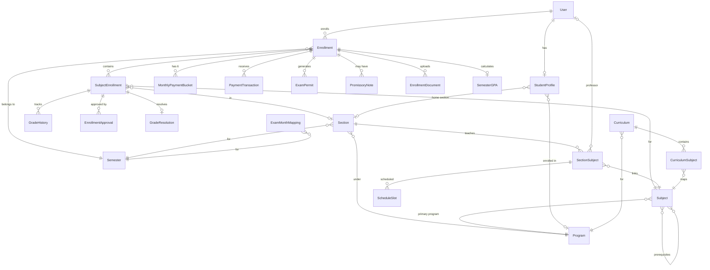

# Richwell Colleges Portal — Database Schema

All models use UUID primary keys, soft-delete (`is_deleted`), and automatic timestamps (`created_at`, `updated_at`) via the `BaseModel` abstract class.

---

## Entity Relationship Overview

---

## 1. Core App

### BaseModel (Abstract)

All models inherit from this.

| Field | Type | Notes |
|-------|------|-------|
| `id` | UUID | Primary key, auto-generated |
| `created_at` | DateTime | Auto set on creation |
| `updated_at` | DateTime | Auto set on save |
| `is_deleted` | Boolean | Soft-delete flag, default `false` |

### SystemConfig

Key-value store for runtime settings.

| Field | Type | Notes |
|-------|------|-------|
| `key` | CharField(100) | Unique. e.g. `ENROLLMENT_ENABLED` |
| `value` | JSONField | Boolean, string, number, or object |
| `description` | TextField | What this setting controls |

### Notification

| Field | Type | Notes |
|-------|------|-------|
| `user` | FK → User | Recipient |
| `notification_type` | CharField(20) | `PAYMENT`, `ENROLLMENT`, `DOCUMENT`, `GRADE`, `ANNOUNCEMENT`, `SYSTEM` |
| `title` | CharField(200) | Subject line |
| `message` | TextField | Body text |
| `link` | CharField(500) | Optional deep link |
| `is_read` | Boolean | Default `false` |
| `created_at` | DateTime | Auto |

---

## 2. Accounts App

### User

Custom user model with email as the unique identifier.

| Field | Type | Notes |
|-------|------|-------|
| `id` | UUID | PK |
| `email` | EmailField | Unique, used as `USERNAME_FIELD` |
| `first_name` | CharField(50) | |
| `last_name` | CharField(50) | |
| `middle_name` | CharField(50) | Optional |
| `suffix` | CharField(10) | Optional (Jr., Sr., III) |
| `role` | CharField(30) | See roles below |
| `student_number` | CharField(20) | Unique, nullable |
| `phone_number` | CharField(20) | Optional |
| `is_active` | Boolean | Django auth flag |
| `is_staff` | Boolean | Django admin access |
| `created_at` | DateTime | |

**User.Role choices:**

| Value | Label |
|-------|-------|
| `STUDENT` | Student |
| `PROFESSOR` | Professor |
| `CASHIER` | Cashier |
| `REGISTRAR` | Registrar |
| `HEAD_REGISTRAR` | Head Registrar |
| `ADMISSION_STAFF` | Admission Staff |
| `DEPARTMENT_HEAD` | Department Head |
| `ADMIN` | Admin |

### StudentProfile

One-to-one extension of User for students.

| Field | Type | Notes |
|-------|------|-------|
| `user` | O2O → User | `related_name='student_profile'` |
| `program` | FK → Program | Nullable |
| `home_section` | FK → Section | Nullable |
| `year_level` | IntegerField | 1–5 |
| `birthday` | DateField | |
| `gender` | CharField | `MALE`, `FEMALE`, `OTHER` |
| `address` | TextField | |
| `civil_status` | CharField | |
| `nationality` | CharField | Default `Filipino` |
| `religion` | CharField | |
| `guardian_name` | CharField | |
| `guardian_phone` | CharField | |
| `guardian_relationship` | CharField | |
| `emergency_contact_name` | CharField | |
| `emergency_contact_phone` | CharField | |
| `previous_school` | CharField | |
| `previous_school_address` | CharField | |
| `school_year_graduated` | CharField | |
| `is_transferee` | Boolean | |
| `is_irregular` | Boolean | Controls AM/PM vs manual enrollment |
| `is_working_student` | Boolean | |
| `status` | CharField | `ACTIVE`, `LOA`, `WITHDRAWN`, `GRADUATED`, `INACTIVE` |
| `academic_status` | CharField | `REGULAR`, `PROBATION`, `DISMISSED` |
| `preferred_shift` | CharField | `AM`, `PM`, `NO_PREFERENCE` |
| `academic_standing` | CharField | Free text (e.g. "Dean's List") |

---

## 3. Academics App

### Program

| Field | Type | Notes |
|-------|------|-------|
| `code` | CharField(50) | Unique. e.g. `BSIT` |
| `name` | CharField(200) | Full name |
| `description` | TextField | Optional |
| `duration_years` | IntegerField | e.g. 4 |
| `is_active` | Boolean | |

### Room

| Field | Type | Notes |
|-------|------|-------|
| `name` | CharField(50) | Unique. e.g. `Room 101` |
| `capacity` | IntegerField | Max students |
| `building` | CharField(100) | |
| `room_type` | CharField(20) | `LECTURE`, `COMPUTER_LAB` |
| `is_active` | Boolean | |

### Subject

| Field | Type | Notes |
|-------|------|-------|
| `program` | FK → Program | Primary program |
| `programs` | M2M → Program | Additional programs sharing this subject |
| `code` | CharField(20) | Globally unique |
| `title` | CharField(200) | |
| `description` | TextField | |
| `units` | IntegerField | 1–12 |
| `lab_units` | IntegerField | 0–6 |
| `lecture_hours` | Decimal | |
| `lab_hours` | Decimal | |
| `year_level` | IntegerField | 1–5 |
| `semester_number` | IntegerField | 1=1st, 2=2nd, 3=Summer |
| `prerequisites` | M2M → Subject | Self-referencing |
| `is_major` | Boolean | Affects INC expiry (6 vs 12 months) |
| `is_active` | Boolean | |

### Section

| Field | Type | Notes |
|-------|------|-------|
| `name` | CharField(50) | e.g. `BSIT-1A` |
| `program` | FK → Program | |
| `semester` | FK → Semester | |
| `year_level` | IntegerField | 1–5 |
| `max_students` | IntegerField | Capacity |
| `is_dissolved` | Boolean | |
| `shift` | CharField(10) | `AM`, `PM`, `FULL_DAY` |

**Unique constraint:** `(name, semester)`

### SectionSubject

Junction table linking sections to subjects with a professor.

| Field | Type | Notes |
|-------|------|-------|
| `section` | FK → Section | |
| `subject` | FK → Subject | |
| `professor` | FK → User | Nullable |

### ScheduleSlot

| Field | Type | Notes |
|-------|------|-------|
| `section_subject` | FK → SectionSubject | |
| `day` | CharField | `MON`, `TUE`, `WED`, `THU`, `FRI`, `SAT` |
| `start_time` | TimeField | |
| `end_time` | TimeField | |
| `room` | FK → Room | Nullable |

### Curriculum

| Field | Type | Notes |
|-------|------|-------|
| `program` | FK → Program | |
| `name` | CharField | |
| `academic_year` | CharField | |
| `is_active` | Boolean | |

### CurriculumSubject

| Field | Type | Notes |
|-------|------|-------|
| `curriculum` | FK → Curriculum | |
| `subject` | FK → Subject | |
| `year_level` | IntegerField | |
| `semester_number` | IntegerField | |

---

## 4. Enrollment App

### Semester

| Field | Type | Notes |
|-------|------|-------|
| `name` | CharField(50) | e.g. `1st Semester` |
| `academic_year` | CharField(20) | e.g. `2025-2026` |
| `start_date` | DateField | |
| `end_date` | DateField | |
| `enrollment_start_date` | DateField | Nullable |
| `enrollment_end_date` | DateField | Nullable |
| `grading_start_date` | DateField | Nullable |
| `grading_end_date` | DateField | Nullable |
| `is_current` | Boolean | Only one active at a time |
| `term_status` | CharField | `SETUP`, `ENROLLMENT_OPEN`, `ENROLLMENT_CLOSED`, `GRADING_OPEN`, `GRADING_CLOSED`, `ARCHIVED` |

**Unique constraint:** `(name, academic_year)`

### Enrollment

| Field | Type | Notes |
|-------|------|-------|
| `student` | FK → User | |
| `semester` | FK → Semester | |
| `status` | CharField | See below |
| `created_via` | CharField | `ONLINE`, `TRANSFEREE`, `MANUAL` |
| `monthly_commitment` | Decimal | Monthly payment amount |
| `first_month_paid` | Boolean | |
| `total_assessment` | Decimal | |
| `discount_amount` | Decimal | |
| `assigned_visit_date` | DateField | Nullable — Admission flow |
| `admission_notes` | TextField | |

**Enrollment.Status choices:**

| Value | Label |
|-------|-------|
| `PENDING_ADMISSION` | Pending Admission |
| `PENDING` | Pending Approval |
| `ACTIVE` | Active |
| `PENDING_PAYMENT` | Pending Payment |
| `HOLD` | On Hold |
| `COMPLETED` | Completed |
| `REJECTED` | Rejected |
| `ADMITTED` | Admitted (No Subject Enrollment) |

**Unique constraint:** `(student, semester)`

### MonthlyPaymentBucket

6 buckets per enrollment (one per month).

| Field | Type | Notes |
|-------|------|-------|
| `enrollment` | FK → Enrollment | |
| `month_number` | IntegerField | 1–6 |
| `required_amount` | Decimal | |
| `paid_amount` | Decimal | Default 0 |
| `due_date` | DateField | |
| `is_paid` | Boolean | |

**Unique constraint:** `(enrollment, month_number)`

### EnrollmentDocument

| Field | Type | Notes |
|-------|------|-------|
| `enrollment` | FK → Enrollment | |
| `document_type` | CharField | `ID`, `FORM_138`, `TOR`, `GOOD_MORAL`, `BIRTH_CERTIFICATE`, `PHOTO`, `OTHER` |
| `file` | FileField | Uploaded file |
| `is_verified` | Boolean | |
| `verified_by` | FK → User | Nullable |
| `verified_at` | DateTime | Nullable |
| `notes` | TextField | |

### SubjectEnrollment

| Field | Type | Notes |
|-------|------|-------|
| `enrollment` | FK → Enrollment | |
| `subject` | FK → Subject | |
| `section` | FK → Section | Nullable |
| `enrollment_type` | CharField | `HOME`, `RETAKE`, `OVERLOAD` |
| `status` | CharField | See below |
| `grade` | Decimal | Nullable, 1.0–5.0 |
| `grade_status` | CharField | |
| `inc_date` | DateField | When INC was assigned |
| `inc_expiry_date` | DateField | Auto-calculated |
| `head_approved` | Boolean | |
| `head_approved_by` | FK → User | |
| `head_approved_at` | DateTime | |
| `registrar_approved` | Boolean | |
| `registrar_approved_by` | FK → User | |
| `registrar_approved_at` | DateTime | |

**SubjectEnrollment.Status choices:**

| Value | Label |
|-------|-------|
| `ENROLLED` | Currently Enrolled |
| `PASSED` | Passed |
| `FAILED` | Failed |
| `INC` | Incomplete |
| `DROPPED` | Dropped |
| `CREDITED` | Credited (Transferee) |
| `RETAKE` | Retake |
| `FOR_RESOLUTION` | For Resolution |
| `PENDING_PAYMENT` | Pending Payment |
| `PENDING_HEAD` | Pending Head Approval |

**Unique constraint:** `(enrollment, subject)`

### EnrollmentApproval

Audit trail for head/registrar approval actions.

| Field | Type | Notes |
|-------|------|-------|
| `subject_enrollment` | FK → SubjectEnrollment | |
| `approved_by` | FK → User | |
| `role` | CharField | `HEAD`, `REGISTRAR`, `ADMIN` |
| `action` | CharField | `APPROVE`, `REJECT`, `OVERRIDE` |
| `comment` | TextField | |

---

## 5. Grading Models (`models_grading.py`)

### GradeHistory

Immutable audit trail for every grade change.

| Field | Type | Notes |
|-------|------|-------|
| `subject_enrollment` | FK → SubjectEnrollment | |
| `old_grade` | Decimal | Nullable |
| `new_grade` | Decimal | Nullable |
| `old_status` | CharField | |
| `new_status` | CharField | |
| `changed_by` | FK → User | |
| `change_reason` | TextField | |
| `is_system_action` | Boolean | e.g. INC expiry |
| `is_finalization` | Boolean | Registrar lock |

### SemesterGPA

| Field | Type | Notes |
|-------|------|-------|
| `enrollment` | O2O → Enrollment | |
| `gpa` | Decimal(3,2) | 1.00–5.00 |
| `total_units` | IntegerField | |
| `earned_units` | IntegerField | |
| `calculated_at` | DateTime | Auto-updated |
| `is_finalized` | Boolean | |

### GradeResolution

5-step workflow for resolving INC/failed grades.

| Field | Type | Notes |
|-------|------|-------|
| `subject_enrollment` | FK → SubjectEnrollment | |
| `requested_by` | FK → User | Professor or Dean |
| `reason` | TextField | |
| `requested_grade` | Decimal | Nullable |
| `status` | CharField | See below |
| `registrar_initial_by` | FK → User | Step 2 |
| `registrar_initial_at` | DateTime | |
| `grade_input_by` | FK → User | Step 3 |
| `grade_input_at` | DateTime | |
| `grade_input_comment` | TextField | |
| `submitted_by_dean` | Boolean | |
| `head_action_by` | FK → User | Step 4 |
| `head_action_at` | DateTime | |
| `registrar_final_by` | FK → User | Step 5 |
| `registrar_final_at` | DateTime | |

**GradeResolution.Status choices:**

| Value | Step | Label |
|-------|------|-------|
| `PENDING_REGISTRAR_INITIAL` | 1 | Pending Registrar Review |
| `GRADE_INPUT_PENDING` | 2 | Waiting for Grade Input |
| `PENDING_HEAD` | 3 | Pending Head Approval |
| `PENDING_REGISTRAR_FINAL` | 4 | Pending Registrar Final |
| `APPROVED` | 5 | Approved |
| `REJECTED` | — | Rejected |
| `CANCELLED` | — | Cancelled |

---

## 6. Payment Models (`models_payments.py`)

### PaymentTransaction

| Field | Type | Notes |
|-------|------|-------|
| `enrollment` | FK → Enrollment | |
| `amount` | Decimal | |
| `payment_mode` | CharField | `CASH`, `ONLINE`, `GCASH`, `MAYA`, `CHECK`, `OTHER` |
| `reference_number` | CharField | |
| `receipt_number` | CharField | Nullable |
| `processed_by` | FK → User | Cashier |
| `processed_at` | DateTime | |
| `target_month` | IntegerField | 1–6 |
| `is_adjustment` | Boolean | |
| `adjustment_type` | CharField | `CREDIT`, `DEBIT` |
| `notes` | TextField | |

### ExamMonthMapping

Maps exam periods to payment months.

| Field | Type | Notes |
|-------|------|-------|
| `semester` | FK → Semester | |
| `exam_period` | CharField | `PRELIM`, `MIDTERM`, `PREFINAL`, `FINAL` |
| `required_month` | IntegerField | 1–6 |
| `is_active` | Boolean | |

**Unique constraint:** `(semester, exam_period)`

### ExamPermit

| Field | Type | Notes |
|-------|------|-------|
| `enrollment` | FK → Enrollment | |
| `exam_period` | CharField | `PRELIM`, `MIDTERM`, `PREFINAL`, `FINAL` |
| `generated_at` | DateTime | |
| `generated_by` | FK → User | |
| `is_printed` | Boolean | |
| `printed_by` | FK → User | Nullable |

**Unique constraint:** `(enrollment, exam_period)`

### PromissoryNote

| Field | Type | Notes |
|-------|------|-------|
| `enrollment` | FK → Enrollment | |
| `month_number` | IntegerField | 1–6 |
| `total_amount` | Decimal | |
| `amount_paid` | Decimal | Default 0 |
| `due_date` | DateField | |
| `status` | CharField | `ACTIVE`, `PARTIALLY_PAID`, `FULFILLED`, `DEFAULTED`, `CANCELLED` |
| `reason` | TextField | |
| `created_by` | FK → User | Cashier |
| `student_signature` | Boolean | Student agreed |
| `student_signed_at` | DateTime | |
| `notes` | TextField | |

---

## 7. Audit App

### AuditLog

Immutable — cannot be updated or deleted.

| Field | Type | Notes |
|-------|------|-------|
| `id` | UUID | PK |
| `actor` | FK → User | Nullable (system actions) |
| `action` | CharField(50) | 50+ action types |
| `target_model` | CharField(100) | e.g. `Enrollment` |
| `target_id` | CharField(100) | UUID of target record |
| `payload` | JSONField | Before/after data |
| `ip_address` | GenericIPAddressField | |
| `user_agent` | CharField(500) | |
| `timestamp` | DateTime | Indexed |

**Indexes:** `(actor, timestamp)`, `(action, timestamp)`, `(target_model, target_id)`
