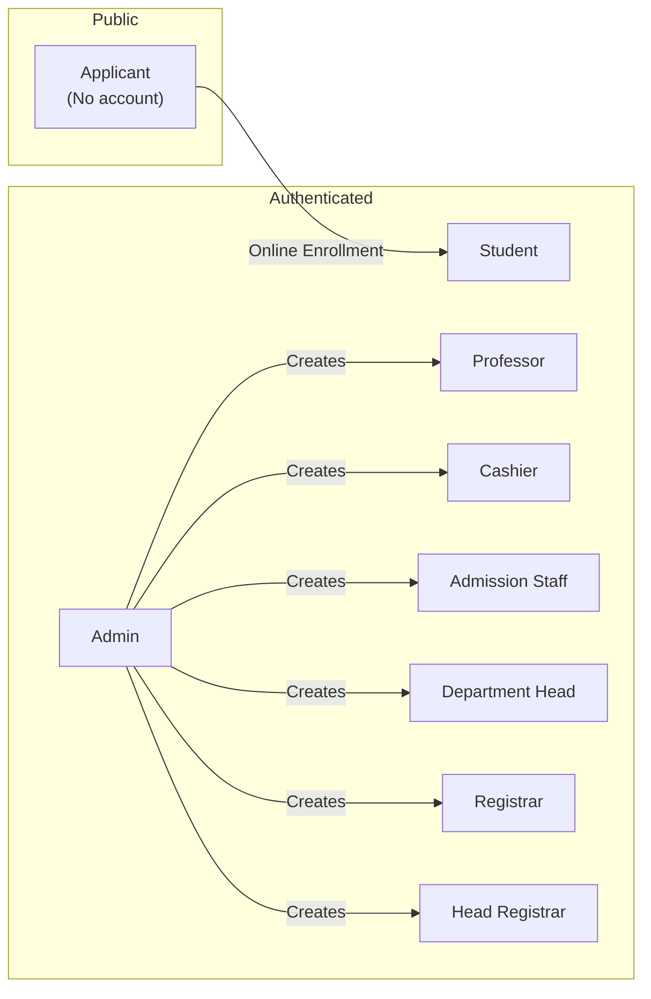

# Richwell Colleges Portal — User Roles & Permissions

## Role Summary

---

## 1. Student (`STUDENT`)

**Description:** An enrolled student who can manage their enrollment, view grades, check payment status, and download documents.

### Accessible Pages

| Page | Path | Purpose |
|------|------|---------|
| Enrollment Dashboard | `/enrollment` | View enrollment status and steps |
| Subject Enrollment | `/enrollment/subjects` | Pick subjects or auto-assign AM/PM |
| Grades | `/student/grades` | View current and past grades |
| Schedule | `/student/schedule` | View weekly class schedule |
| SOA (Statement of Account) | `/student/soa` | View payment breakdown |
| Exam Permits | `/student/exam-permits` | View and download exam permits |
| Curriculum | `/student/curriculum` | View curriculum progress |

### API Access

| Category | Endpoints |
|----------|-----------|
| Enrollment | `my-enrollment/`, `my-enrollment/shift-preference/` |
| Subjects | `subjects/recommended/`, `subjects/available/`, `subjects/my-enrollments/`, `my-schedule/`, `my-curriculum/` |
| Subject Actions | `subjects/enroll/`, `subjects/bulk-enroll/`, `subjects/auto-assign/`, `subjects/{id}/drop/`, `subjects/{id}/edit/` |
| Payments | `my-enrollment/payments/` |
| Exams | `my-enrollment/exam-permits/` |
| Grades | `my-enrollment/grades/`, `my-enrollment/transcript/` |
| Documents | `enrollment/{id}/documents/` (upload) |

### Key Actions
- ✅ Enroll in subjects (manual or auto-assign)
- ✅ Drop subjects
- ✅ Upload required documents
- ✅ View grades and transcript
- ✅ View payment history
- ✅ Download exam permits
- ❌ Cannot edit grades
- ❌ Cannot access other students' records

---

## 2. Professor (`PROFESSOR`)

**Description:** A faculty member who teaches courses, submits grades, and initiates grade resolutions.

### Accessible Pages

| Page | Path | Purpose |
|------|------|---------|
| Grades | `/professor/grades` | Submit and manage grades |
| Sections | `/professor/sections` | View assigned sections |
| Schedule | `/professor/schedule` | View teaching schedule |
| Resolutions | `/professor/resolutions` | Manage grade resolutions |

### API Access

| Category | Endpoints |
|----------|-----------|
| Grading | `grading/sections/`, `grading/students/`, `grading/submit/`, `grading/bulk/`, `grading/deadline-status/` |
| Resolutions | `grade-resolutions/` (CRUD), `grade-resolutions/{id}/input_grade/` |
| Legacy | `grades/my-sections/`, `grades/section/{id}/subject/{id}/students/`, `grades/submit/`, `grades/history/{id}/` |

### Key Actions
- ✅ Submit/edit grades within grading window
- ✅ Bulk submit grades for a section
- ✅ Open grade resolution requests
- ✅ Input grade during resolution step 3
- ❌ Cannot finalize grades (Registrar only)
- ❌ Cannot override existing grades

---

## 3. Cashier (`CASHIER`)

**Description:** Handles all payment operations including recording payments, managing promissory notes, and generating exam permits.

### Accessible Pages

| Page | Path | Purpose |
|------|------|---------|
| Payment Dashboard | `/cashier` | Search students, record payments |
| Payment History | `/cashier/history` | View transaction history |

### API Access

| Category | Endpoints |
|----------|-----------|
| Payments | `payments/record/`, `payments/adjust/`, `payments/transactions/`, `payments/student/{id}/` |
| Search | `cashier/students/search/`, `cashier/students/pending-payments/`, `cashier/today-transactions/` |
| Exam Permits | `exam-permits/{period}/generate/`, `exam-permits/{id}/print/`, `exam-permits/` |
| Promissory Notes | `promissory-notes/` (CRUD), `promissory-notes/{id}/record_payment/`, `promissory-notes/{id}/mark_defaulted/` |

### Key Actions
- ✅ Record payments (cash, GCash, Maya, online, etc.)
- ✅ Adjust payments (credit/debit)
- ✅ Create promissory notes
- ✅ Record payments against promissory notes
- ✅ Generate/print exam permits
- ❌ Cannot modify enrollment status
- ❌ Cannot access grades

---

## 4. Admission Staff (`ADMISSION_STAFF`)

**Description:** Reviews new applicants, verifies documents, assigns visit dates, and processes admissions.

### Accessible Pages

| Page | Path | Purpose |
|------|------|---------|
| Admission Dashboard | `/admission` | Review and manage applicants |

### API Access

| Category | Endpoints |
|----------|-----------|
| Applicants | `applicants/`, `applicants/{id}/` |
| Documents | `documents/{id}/verify/` |
| Utilities | `next-student-number/` |

### Key Actions
- ✅ View all applicant submissions
- ✅ Approve/reject applicants
- ✅ Assign visit dates
- ✅ Verify uploaded documents
- ✅ Generate student numbers
- ❌ Cannot manage actively enrolled students
- ❌ Cannot process payments or grades

---

## 5. Registrar (`REGISTRAR`)

**Description:** Core administrative role managing students, grades finalization, enrollment overrides, document release, and transferee handling.

### Accessible Pages

| Page | Path | Purpose |
|------|------|---------|
| Students | `/registrar/students` | Full student management |
| Grade Finalization | `/registrar/grades` | Finalize section grades |
| Sections | `/registrar/sections` | Section management |
| Documents | `/registrar/documents` | Release and manage documents |
| Enrollment | `/registrar/enrollment` | View/override enrollments |

### API Access

| Category | Endpoints |
|----------|-----------|
| Students | All `/accounts/students/` endpoints |
| Transferees | `transferee/`, `transferee/{id}/credits/` |
| Overrides | `enrollment/{id}/override-enroll/` |
| Grades | `grades/sections/`, `grades/section/{id}/finalize/`, `grades/override/`, `grades/inc-report/` |
| Resolutions | `grade-resolutions/{id}/registrar_initial_approve/`, `grade-resolutions/{id}/registrar_final_approve/` |
| Documents | `documents/release/`, `documents/my-releases/`, `documents/{code}/`, `documents/{code}/revoke/`, `documents/{code}/reissue/`, `documents/all/`, `documents/stats/` |
| Standing | `students/{id}/standing/` |
| COR | `enrollment/{id}/cor/` |
| Export | `export/students/`, `export/enrollments/`, `export/payments/` |

### Key Actions
- ✅ Finalize all section grades
- ✅ Override grades
- ✅ Override enrollment (bypass validations)
- ✅ Create transferee enrollments + credit subjects
- ✅ Release official documents (TOR, Good Moral, etc.)
- ✅ Revoke and reissue documents
- ✅ Initial and final approval in grade resolution workflow
- ✅ Process expired INC grades
- ✅ Export data to CSV

---

## 6. Head Registrar (`HEAD_REGISTRAR`)

**Description:** Highest-level Registrar role. Same powers as Registrar with system-wide authority.

Inherits **all** Registrar permissions plus:
- ✅ Access to head-level reports
- ✅ No department restrictions on views

---

## 7. Department Head (`DEPARTMENT_HEAD`)

**Description:** Head of an academic department. Approves or rejects student subject enrollments and grade resolutions within their department.

### Accessible Pages

| Page | Path | Purpose |
|------|------|---------|
| Head Dashboard | `/head` | Overview of pending tasks |
| Pending Enrollments | `/head/enrollments` | Subject enrollment approvals |
| Students | `/head/students` | Department students |
| Reports | `/head/reports` | Department analytics |
| Resolutions | `/head/resolutions` | Grade resolution approvals |

### API Access

| Category | Endpoints |
|----------|-----------|
| Enrollments | `head/pending-enrollments/`, `head/approve/{id}/`, `head/reject/{id}/`, `head/bulk-approve/` |
| Resolutions | `grade-resolutions/{id}/head_approve/` |
| Reports | `reports/`, `reports/admission-stats/`, `reports/payment-report/`, `reports/enrollment-stats/` |

### Key Actions
- ✅ Approve/reject subject enrollments for their department
- ✅ Bulk approve multiple enrollments
- ✅ Approve grade resolutions (Step 4)
- ✅ View department-specific reports and analytics
- ❌ Cannot finalize or override grades
- ❌ Cannot access students outside their department

---

## 8. Admin (`ADMIN`)

**Description:** System superadmin with full access to every feature, user management, term management, and audit logs.

### Accessible Pages

| Page | Path | Purpose |
|------|------|---------|
| Audit Logs | `/admin/audit` | View all system activity |
| User Management | `/admin/users` | Create and manage users |
| Term Management | `/admin/terms` | Configure semesters |
| System Config | — | Manage key-value settings |

### API Access

**Full access to ALL endpoints**, plus exclusive access to:

| Category | Endpoints |
|----------|-----------|
| Users | `accounts/users/`, `accounts/users/count/`, `accounts/staff/` |
| Semesters | `academics/semesters/` (all CRUD + set_current) |
| System Config | `core/config/` (all CRUD) |
| Audit | `audit/logs/`, `audit/logs/filters/`, `audit/logs/{id}/`, `audit/dashboard/alerts/` |
| INC Processing | `grades/process-expired-incs/` |
| Exam Mapping | `exam-mappings/` (CRUD) |

### Key Actions
- ✅ Create/manage all users (any role)
- ✅ Configure semesters and set current term
- ✅ View complete audit trail
- ✅ Set system configuration flags
- ✅ Process expired INC grades
- ✅ Manage exam-month mappings
- ✅ Archive/unarchive records
- ✅ Everything every other role can do

---

## Permission Matrix

| Action | STU | PROF | CASH | ADM_STAFF | HEAD | REG | HEAD_REG | ADMIN |
|--------|-----|------|------|-----------|------|-----|----------|-------|
| Enroll in subjects | ✅ | ❌ | ❌ | ❌ | ❌ | ✅¹ | ✅¹ | ✅ |
| Submit grades | ❌ | ✅ | ❌ | ❌ | ❌ | ❌ | ❌ | ❌ |
| Finalize grades | ❌ | ❌ | ❌ | ❌ | ❌ | ✅ | ✅ | ✅ |
| Override grades | ❌ | ❌ | ❌ | ❌ | ❌ | ✅ | ✅ | ✅ |
| Record payments | ❌ | ❌ | ✅ | ❌ | ❌ | ❌ | ❌ | ✅ |
| Generate exam permits | ❌ | ❌ | ✅ | ❌ | ❌ | ❌ | ❌ | ✅ |
| Approve enrollments | ❌ | ❌ | ❌ | ❌ | ✅ | ❌ | ❌ | ✅ |
| Release documents | ❌ | ❌ | ❌ | ❌ | ❌ | ✅ | ✅ | ✅ |
| Review applicants | ❌ | ❌ | ❌ | ✅ | ❌ | ❌ | ❌ | ✅ |
| Manage users | ❌ | ❌ | ❌ | ❌ | ❌ | ❌ | ❌ | ✅ |
| View audit logs | ❌ | ❌ | ❌ | ❌ | ❌ | ❌ | ❌ | ✅ |
| View reports | ❌ | ❌ | ❌ | ❌ | ✅ | ✅ | ✅ | ✅ |

¹ Via override enrollment
