# Richwell Colleges Portal — Business Flows

Detailed step-by-step workflows for every major process in the system.

---

## 1. Online Enrollment Flow

The end-to-end journey of a new student from applicant to fully enrolled.

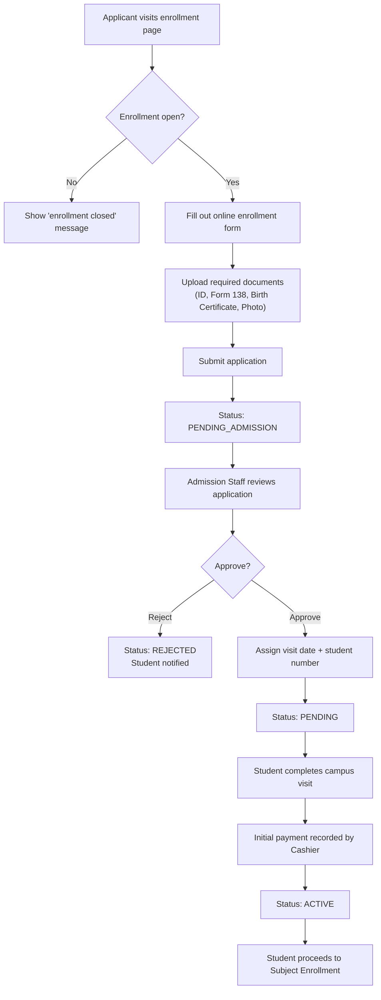

### Actors & Responsibilities

| Step | Actor | API Endpoint |
|------|-------|-------------|
| Submit form | Applicant | `POST /admissions/enroll/` |
| Upload docs | Applicant | `POST /admissions/enrollment/{id}/documents/` |
| Review & approve | Admission Staff | `PATCH /admissions/applicants/{id}/` |
| Verify docs | Admission Staff | `PATCH /admissions/documents/{id}/verify/` |
| Record payment | Cashier | `POST /admissions/payments/record/` |

---

## 2. Subject Enrollment — Regular Student (AM/PM Auto-Assign)

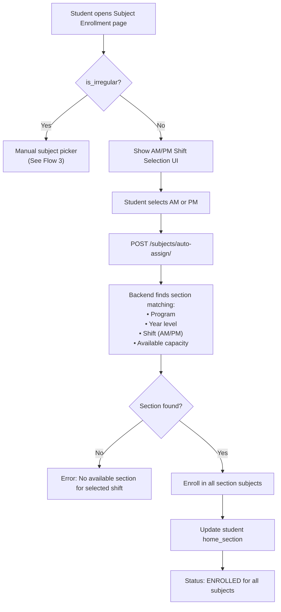

---

## 3. Subject Enrollment — Irregular Student (Manual)

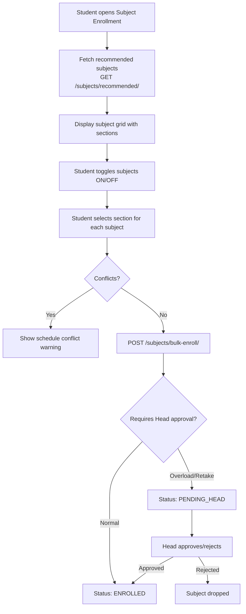

---

## 4. Payment Flow

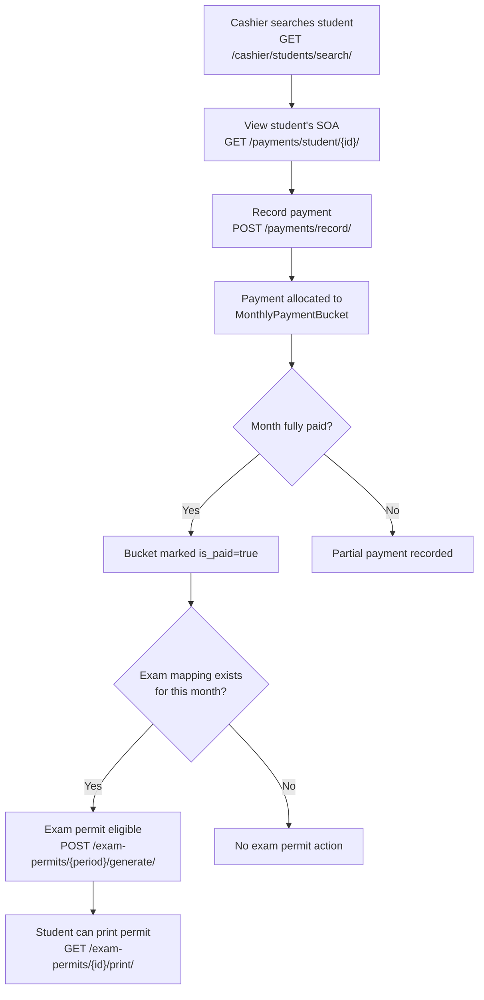

### Payment Adjustment Flow

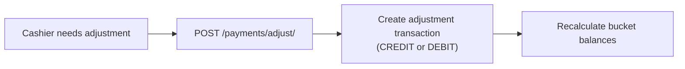

---

## 5. Promissory Note Flow

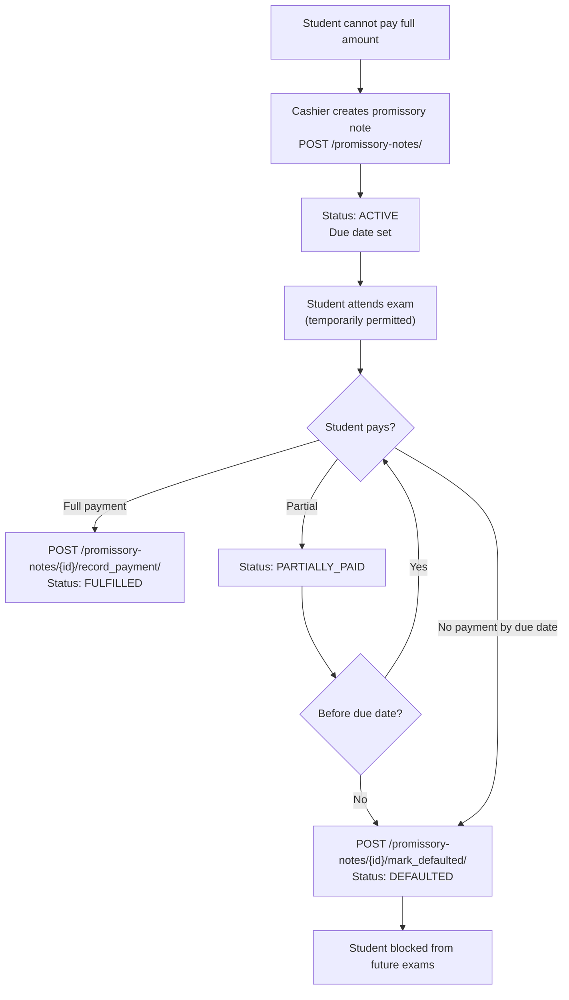

---

## 6. Grade Submission Flow

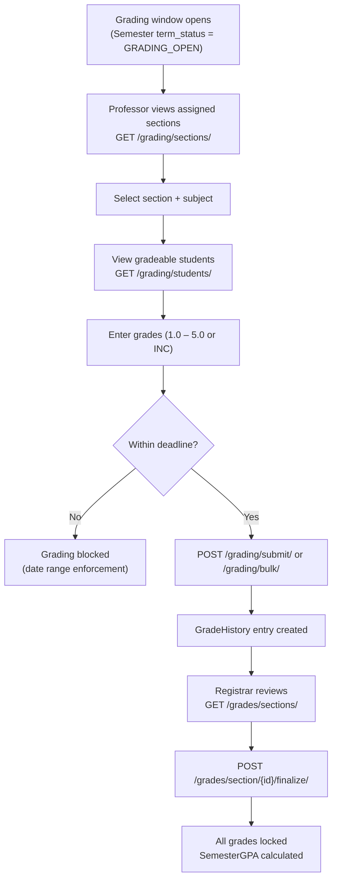

### INC Grade Lifecycle

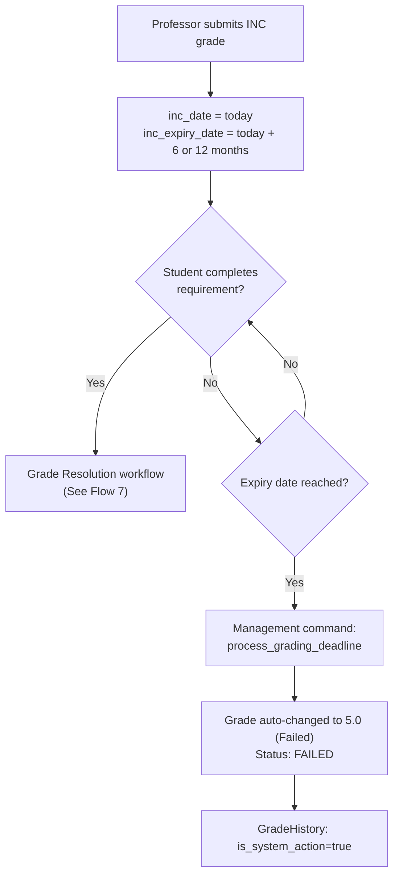

---

## 7. Grade Resolution (5-Step Workflow)

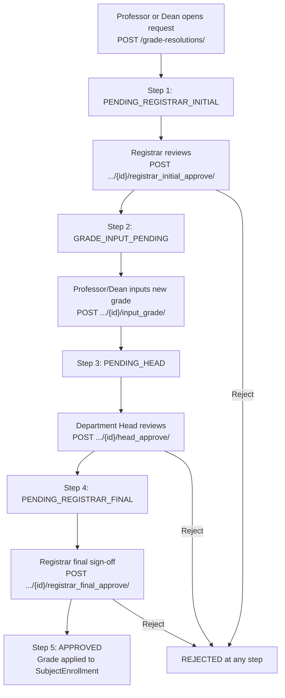

### Step Details

| Step | Actor | Action | Status After |
|------|-------|--------|-------------|
| 1 | Professor/Dean | Opens request with reason | `PENDING_REGISTRAR_INITIAL` |
| 2 | Registrar | Reviews and approves to proceed | `GRADE_INPUT_PENDING` |
| 3 | Professor/Dean | Inputs new grade + comment | `PENDING_HEAD` |
| 4 | Department Head | Reviews and approves | `PENDING_REGISTRAR_FINAL` |
| 5 | Registrar | Final sign-off, grade applied | `APPROVED` |

---

## 8. Document Release Flow

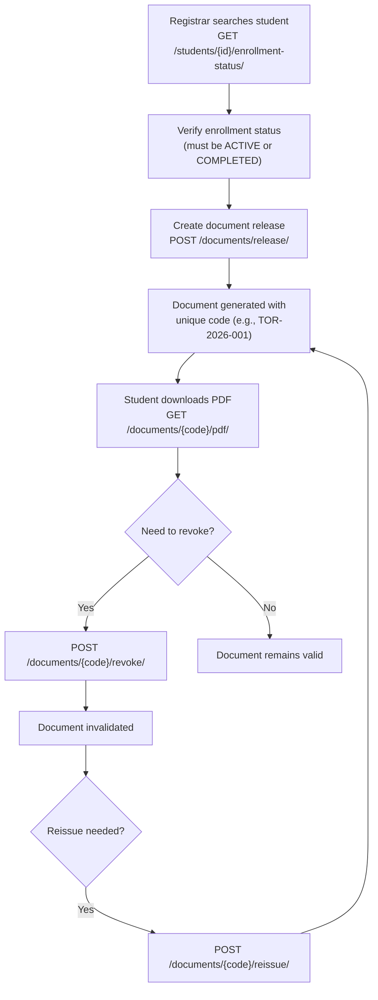

---

## 9. Exam Permit Generation

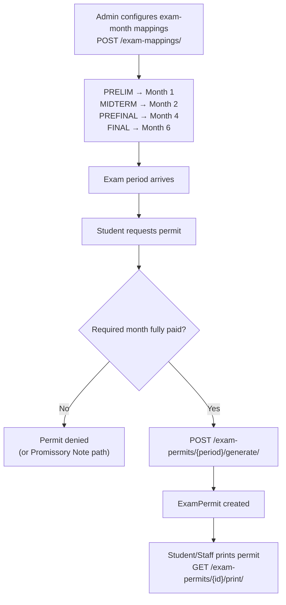

---

## 10. Semester Lifecycle

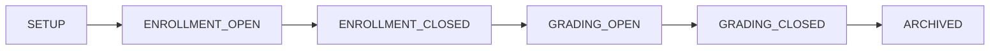

| Phase | What happens |
|-------|-------------|
| `SETUP` | Admin creates semester, sections, schedules |
| `ENROLLMENT_OPEN` | Students can enroll, pick subjects |
| `ENROLLMENT_CLOSED` | No more enrollment changes |
| `GRADING_OPEN` | Professors submit grades |
| `GRADING_CLOSED` | No more grade changes, registrar finalizes |
| `ARCHIVED` | Read-only historical record |
