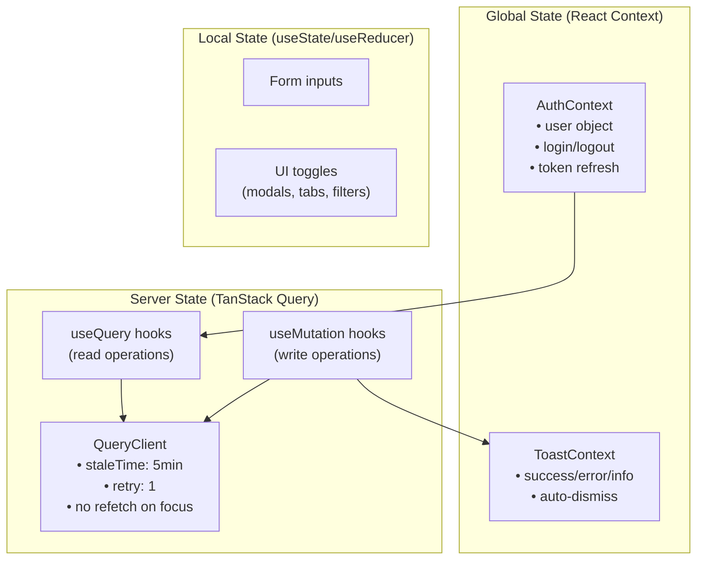
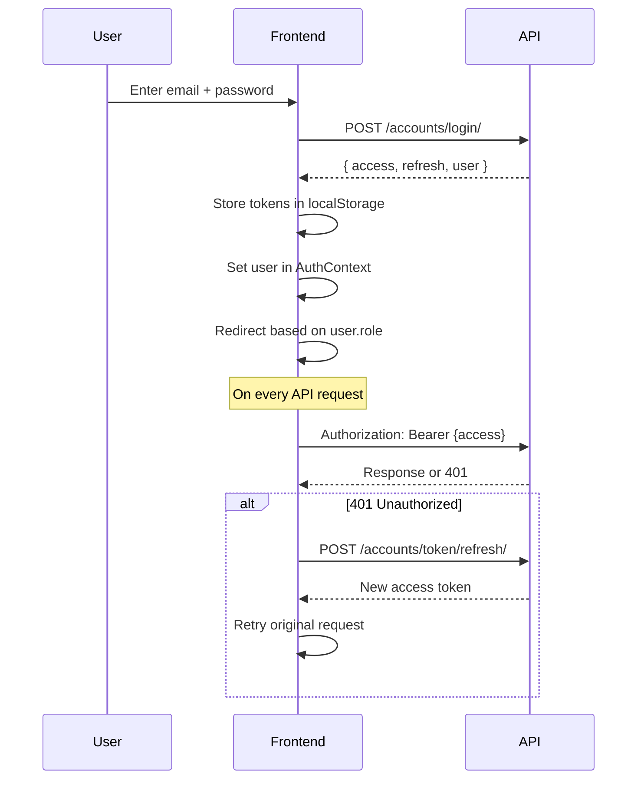

# Richwell Colleges Portal — Frontend Architecture

## 1. Project Structure

```
frontend/
├── src/
│   ├── api/
│   │   ├── client.js              # Axios instance with JWT interceptors
│   │   └── endpoints.js           # 200+ centralized endpoint definitions
│   │
│   ├── context/
│   │   ├── AuthContext.jsx         # Authentication state, login/logout, user role
│   │   └── ToastContext.jsx        # Global toast notifications
│   │
│   ├── hooks/
│   │   ├── useDebounce.js          # Input debouncing
│   │   ├── useEnrollment.js        # Enrollment data + auto-assign mutation
│   │   ├── useForm.js              # Form state management
│   │   └── useSchedule.js          # Schedule data formatting
│   │
│   ├── components/
│   │   ├── auth/
│   │   │   └── ProtectedRoute.jsx  # Role-based route guard
│   │   ├── layout/
│   │   │   └── Header.jsx          # App-wide navigation header
│   │   ├── shared/                 # Reusable shared components
│   │   │   ├── Breadcrumbs.jsx
│   │   │   ├── ConfirmModal.jsx
│   │   │   ├── MobileMenu.jsx
│   │   │   ├── NotFound.jsx
│   │   │   ├── NotificationBell.jsx
│   │   │   ├── PageHeader.jsx
│   │   │   ├── ProgramPicker.jsx
│   │   │   ├── ResolutionStatus.jsx
│   │   │   └── SEO.jsx
│   │   ├── skeletons/
│   │   │   └── DashboardSkeleton.jsx
│   │   └── ui/                     # Design system primitives (19 components)
│   │       ├── Badge.jsx
│   │       ├── Button.jsx
│   │       ├── Card.jsx
│   │       ├── DashboardAlerts.jsx
│   │       ├── EmptyState.jsx
│   │       ├── ErrorState.jsx
│   │       ├── ExportButton.jsx
│   │       ├── FormField.jsx
│   │       ├── Input.jsx
│   │       ├── Modal.jsx
│   │       ├── SearchInput.jsx
│   │       ├── Select.jsx
│   │       ├── Skeleton.jsx
│   │       ├── Spinner.jsx
│   │       ├── StatCard.jsx
│   │       ├── Table.jsx
│   │       ├── Tabs.jsx
│   │       ├── Textarea.jsx
│   │       ├── Toast.jsx
│   │       └── index.js            # Barrel export
│   │
│   ├── pages/                      # 12 page modules (see routing table)
│   │   ├── academics/
│   │   ├── admin/
│   │   ├── admission/
│   │   ├── auth/
│   │   ├── cashier/
│   │   ├── enrollment/
│   │   ├── head/
│   │   ├── professor/
│   │   ├── public/
│   │   ├── registrar/
│   │   ├── shared/
│   │   └── student/
│   │
│   ├── App.jsx                     # Root component with routing
│   └── main.jsx                    # Vite entry point
```

---

## 2. Technology Decisions

| Concern | Solution |
|---------|----------|
| **Routing** | React Router v6 with lazy-loaded pages |
| **Server State** | TanStack Query (React Query) — caching, refetch, mutations |
| **Auth State** | React Context (`AuthContext`) with JWT in localStorage |
| **UI Feedback** | React Context (`ToastContext`) for global toasts |
| **Code Splitting** | `React.lazy()` + `Suspense` with `DashboardSkeleton` fallback |
| **HTTP Client** | Axios with interceptors for JWT auto-attach and 401 redirect |
| **Styling** | Tailwind CSS utility classes |
| **Icons** | Lucide React |

---

## 3. Routing Table

All routes are defined in `App.jsx`. Protected routes use the `<ProtectedRoute roles={[...]}/>` wrapper.

### Public Routes

| Path | Component | Description |
|------|-----------|-------------|
| `/` | → `/auth/login` | Root redirect |
| `/auth/login` | `LoginPage` | Login |
| `/auth/forgot-password` | `ForgotPasswordPage` | Password reset request |
| `/auth/reset-password` | `ResetPasswordPage` | Password reset form |
| `/enrollment` | `EnrollmentPage` | Online enrollment form |
| `/enrollment/success` | `EnrollmentSuccess` | Post-enrollment confirmation |

### Student Routes (`STUDENT`)

| Path | Component | Description |
|------|-----------|-------------|
| `/dashboard` | `StudentDashboard` | Student home |
| `/student/dashboard` | `StudentDashboard` | Alias |
| `/student/schedule` | `StudentSchedulePage` | Weekly schedule |
| `/student/exam-permits` | `StudentExamPermitsPage` | Exam permits |
| `/student/grades` | `StudentGradesPage` | Grade viewer |
| `/student/soa` | `StudentSOA` | Statement of Account |
| `/enrollment/subjects` | `SubjectEnrollmentPage` | Subject picker / AM-PM auto-assign |

### Professor Routes (`PROFESSOR`)

| Path | Component | Description |
|------|-----------|-------------|
| `/professor` | `ProfessorDashboard` | Professor home |
| `/professor/schedule` | `ProfessorSchedule` | Teaching schedule |
| `/professor/grades` | `ProfessorGrades` | Grade submission |
| `/professor/sections` | `ProfessorSections` | Assigned sections |
| `/professor/resolutions` | `ProfessorResolutions` | Grade resolutions |

### Registrar Routes (`REGISTRAR`, `ADMIN`)

| Path | Component | Description |
|------|-----------|-------------|
| `/registrar/dashboard` | `RegistrarDashboard` | Registrar home |
| `/registrar/students` | `RegistrarStudentMasterlist` | Student masterlist |
| `/registrar/students/:id` | `RegistrarStudentDetail` | Student detail view |
| `/registrar/subjects` | `RegistrarSubjectMasterlist` | Subject masterlist |
| `/registrar/semesters` | `RegistrarSemesterManagement` | Semester CRUD |
| `/registrar/sections` | `RegistrarSectionManager` | Section management |
| `/registrar/sections/:id` | `RegistrarSectionDetail` | Section detail |
| `/registrar/cor` | `RegistrarCORManagement` | COR generation |
| `/registrar/inc` | `RegistrarINCManagement` | INC grade management |
| `/registrar/grades` | `RegistrarGradeMonitoring` | Grade monitoring |
| `/registrar/grade-finalization` | `RegistrarGradeFinalization` | Finalize grades |
| `/registrar/documents` | `RegistrarDocumentRelease` | Document release |

### Admission Routes (`ADMISSION_STAFF`)

| Path | Component | Description |
|------|-----------|-------------|
| `/admission` | `AdmissionDashboard` | Applicant review dashboard |

### Department Head Routes (`DEPARTMENT_HEAD`)

| Path | Component | Description |
|------|-----------|-------------|
| `/head` | `HeadDashboard` | Head home |
| `/head/students` | `HeadStudents` | Department students |
| `/head/reports` | `HeadReports` | Analytics dashboard |
| `/head/resolutions` | `HeadResolutions` | Grade resolution approvals |

### Cashier Routes (`CASHIER`)

| Path | Component | Description |
|------|-----------|-------------|
| `/cashier` | `CashierDashboard` | Payment operations |
| `/cashier/payments` | `CashierPaymentHistory` | Transaction history |

### Admin Routes (`ADMIN`)

| Path | Component | Description |
|------|-----------|-------------|
| `/admin/dashboard` | `AdminDashboard` | Admin home |
| `/admin/users` | `AdminUserManagement` | User CRUD |
| `/admin/audit-logs` | `AuditLogsPage` | Audit log viewer |
| `/admin/terms` | `AdminTermManagement` | Semester management |
| `/admin/transactions` | `AdminTransactionLog` | Full transaction log |

### Academics Routes (`ADMIN`, `HEAD_REGISTRAR`, `REGISTRAR`)

| Path | Component | Description |
|------|-----------|-------------|
| `/academics` | `AcademicsPage` | Programs & curricula |
| `/academics/programs/:id` | `ProgramDetailPage` | Program detail |

---

## 4. Service Layer

Each page module has a `services/` folder with a single service file that wraps API calls. This enforces separation between UI components and data-fetching logic.

| Service File | Module | Key Methods |
|-------------|--------|-------------|
| `AdmissionService.jsx` | admission | `getApplicants()`, `updateApplicant()`, `verifyDocument()` |
| `CashierService.jsx` | cashier | `searchStudents()`, `recordPayment()`, `getTransactions()` |
| `HeadService.jsx` | head | `getPendingEnrollments()`, `approveSubject()`, `getAdmissionStats()`, `getPaymentReport()` |
| `ProfessorService.jsx` | professor | `getSections()`, `getStudents()`, `submitGrade()`, `bulkSubmitGrades()` |
| `AdminService.jsx` | admin | `getUsers()`, `createUser()`, `getAuditLogs()` |
| `AcademicService.jsx` | admin | `getSemesters()`, `createSemester()`, `setCurrentSemester()` |
| `EnrollmentService.jsx` | enrollment | `getEnrollmentStatus()`, `submitEnrollment()`, `uploadDocument()` |
| `AcademicService.jsx` | registrar | `getStudents()`, `getSections()`, `finalizeGrades()` |
| `CurriculumService.js` | academics | `getCurricula()`, `getCurriculumStructure()`, `assignSubjects()` |
| `ProgramService.js` | academics | `getPrograms()`, `createProgram()`, `updateProgram()` |
| `SectionService.js` | academics | `getSections()`, `createSection()`, `getDetail()` |
| `SchedulingService.js` | academics | `getSlots()`, `createSlot()`, `checkConflicts()` |
| `FacultyService.js` | academics | `getProfessors()`, `getSchedule()` |
| `FacilitiesService.js` | academics | `getRooms()`, `createRoom()` |

---

## 5. State Management Architecture



---

## 6. Authentication Flow



### Role-Based Redirect After Login

| Role | Redirect To |
|------|------------|
| `STUDENT` | `/dashboard` |
| `PROFESSOR` | `/professor` |
| `CASHIER` | `/cashier` |
| `REGISTRAR` | `/registrar/dashboard` |
| `ADMISSION_STAFF` | `/admission` |
| `DEPARTMENT_HEAD` | `/head` |
| `ADMIN` | `/admin/dashboard` |

---

## 7. Component Library (`components/ui/`)

The `ui/` folder provides a design system of **19 reusable primitives**:

| Component | Purpose |
|-----------|---------|
| `Badge` | Status labels with color variants |
| `Button` | Primary/secondary/danger buttons with icons |
| `Card` | Container with rounded corners and shadow |
| `DashboardAlerts` | System alerts for admin dashboard |
| `EmptyState` | Illustrated empty data message |
| `ErrorState` | Error display with retry action |
| `ExportButton` | CSV/PDF export trigger |
| `FormField` | Label + input + error wrapper |
| `Input` | Styled text input |
| `Modal` | Overlay dialog with backdrop |
| `SearchInput` | Input with search icon and debounce |
| `Select` | Styled dropdown select |
| `Skeleton` | Loading placeholder |
| `Spinner` | Animated loading spinner |
| `StatCard` | Dashboard metric card |
| `Table` | Data table with sorting/pagination |
| `Tabs` | Tab navigation component |
| `Textarea` | Multi-line text input |
| `Toast` | Notification popup |

All components are exported from `components/ui/index.js` as a barrel file.

---

## 8. API Client Architecture

```javascript
// api/client.js — Simplified overview
const api = axios.create({
    baseURL: '/api/v1/',
    headers: { 'Content-Type': 'application/json' }
});

// Request interceptor: attach JWT
api.interceptors.request.use(config => {
    const token = localStorage.getItem('access_token');
    if (token) config.headers.Authorization = `Bearer ${token}`;
    return config;
});

// Response interceptor: handle 401 → refresh token
api.interceptors.response.use(
    response => response.data,
    async error => {
        if (error.response?.status === 401) {
            // Attempt token refresh, retry request
        }
        return Promise.reject(error);
    }
);
```

**Endpoints** are centralized in `api/endpoints.js` with both string constants and parameterized functions:

```javascript
const endpoints = {
    login: '/accounts/login/',
    myEnrollment: '/admissions/my-enrollment/',
    studentDetail: (id) => `/accounts/students/${id}/`,
    headApprove: (id) => `/admissions/head/approve/${id}/`,
    // ... 200+ more
};
```
