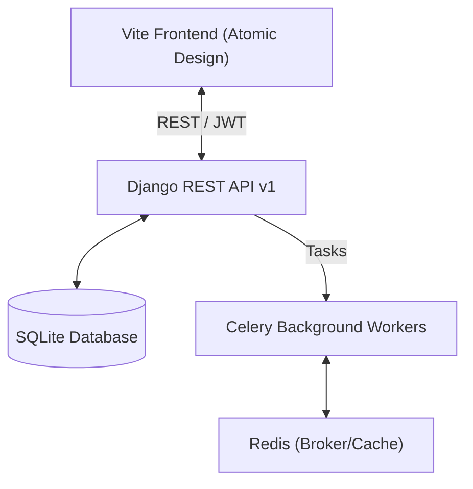

# Comprehensive System Documentation — Richwell Colleges Portal

This document provides a technical overview of the SIS (Student Information System) architecture, implementation details, and data flows.

## 1. System Architecture Overview

The system follows a decoupled architecture with a **Django REST Framework (DRF)** backend and a **Vite + Vanilla JavaScript** frontend.

---

## 2. Backend Implementation (Django)

The backend is organized into modular Django apps, each responsible for specific domain logic.

### Core Apps
- **`apps.accounts`**: Custom User model, JWT authentication, and Role-Based Access Control (RBAC).
- **`apps.enrollment`**: The heavy lifter. Handles applicant onboarding, subject enrollment, payment processing, and grading logic.
- **`apps.academics`**: Manages the curriculum, subjects, sections, and scheduling infrastructure.
- **`apps.core`**: System-wide configurations, notification engines, and shared utilities.
- **`apps.audit`**: Immutable logging of all critical system actions for security and compliance.

### Key Backend Services
- **`EnrollmentService`**: Orchestrates the multi-step enrollment process and business rule validation.
- **`CorService`**: Handles the logic for Certificate of Registration (COR) generation.
- **`PdfGenerator`**: Utility for generating printable receipts, permits, and academic documents.

---

## 3. Frontend Implementation (Vite + Vanilla JS)

The frontend uses a custom **Atomic Design** framework to ensure consistency and reusability without the overhead of a heavy framework.

### Component Hierarchy
- **Atoms**: Basic UI primitives (`Button`, `Badge`, `Input`, `Icon`).
- **Molecules**: Combined primitives (`StatCard`, `SearchBar`, `Alert`).
- **Organisms**: Complex, interactive modules (`DataTable`, `ScheduleGrid`, `FilterPanel`).
- **Templates/Pages**: High-level layouts and entry points.

### Core Infrastructure (`frontend/src/core/`)
- **`SIS.js`**: Global registry and event bus.
- **`BaseComponent.js`**: Base class for all interactive components.
- **`ComponentFactory.js`**: Handles auto-mounting of components via `data-sis-component` attributes.

---

## 4. Data Flow & Integration

### API Communication
All frontend components interact with the backend via a centralized `api.js` client.
- **Authentication**: JWT-based (Access + Refresh tokens stored in LocalStorage).
- **Standardized Responses**: The backend returns consistent JSON envelopes, handled by the `api.handleResponse` utility.

### Key Workflows

#### Enrollment Flow
1. **Applicant Submission**: Public form sends data to `/admissions/enroll/`.
2. **Account Creation**: Backend auto-creates `User` and `Student` records.
3. **Payment & Activation**: Cashier records payment -> `Enrollment` status moves to `ACTIVE`.

#### Subject Selection Flow
1. **Eligibility Check**: Frontend queries `/admissions/subjects/recommended/`.
2. **Validation**: Backend enforces unit caps (max 30) and prerequisites.
3. **Persist**: Enrollment saved via `/admissions/subjects/enroll/`.

---

## 5. Finished Features Map

| Feature Area | Backend Implementation | Frontend UI |
| :--- | :---: | :---: |
| **Authentication** | JWT, Password Reset, RBAC | Login/Logout, Profile Mgmt |
| **Admissions** | Applicant tracking, Doc uploads | Enrollment Form, Dashboard |
| **Academics** | Curriculum, Prereq Trees | Subject/Section Management |
| **Enrollment** | Unit cap enforcement, Prereqs | Subject Picker, Student Schedule |
| **Payments** | Ledger, Receipt Gen, Month Buckets | Student Ledger, Cashier UI |
| **Grading** | Finalization, GPA Compute, INC Logic | Professor Grade Entry, Student Portal |
| **Audit** | Write-once logging, Filtered views | Admin Audit Log Viewer |
| **Notifications** | In-app notification engine | Header Bell, Notification Center |

---

## 6. Directory Structure
- `backend/`: Django project root.
  - `apps/`: Modular domain logic.
  - `config/`: System settings and root URLs.
- `frontend/`: Vite project root.
  - `src/`: Atomic components and core JS logic.
  - `pages/`: Role-based directory structure (Admin, Student, etc.).
- `documentation/`: Business functions and implementation guides.
