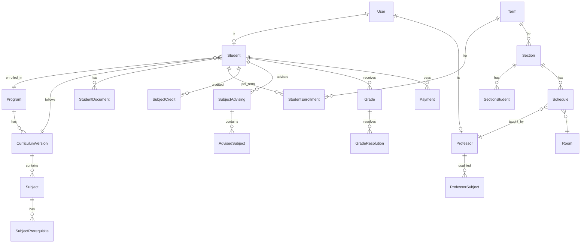

# Richwell Portal — Database Schema

> **Tech Stack:** Django + Django REST Framework + PostgreSQL
> **Last Updated:** 2026-03-07

---

## Entity Relationship Overview



---

## 1. Authentication & Users

### 1.1 `User`

Custom Django user model. All system actors share a single user table with role differentiation.

| Column | Type | Constraints | Notes |
|---|---|---|---|
| `id` | BigAutoField | PK | |
| `username` | CharField(50) | Unique, Required | Login credential |
| `password` | CharField(128) | Required | Django's hashed password |
| `email` | EmailField | Unique, Required | |
| `first_name` | CharField(100) | Required | |
| `last_name` | CharField(100) | Required | |
| `role` | CharField(20) | Required | See choices below |
| `is_active` | BooleanField | Default: True | |
| `created_at` | DateTimeField | Auto | |
| `updated_at` | DateTimeField | Auto | |

**Role Choices:**

| Value | Description |
|---|---|
| `ADMIN` | System administrator |
| `HEAD_REGISTRAR` | Head Registrar (manages registrars + audit logs) |
| `REGISTRAR` | Registrar staff |
| `ADMISSION` | Admission office staff |
| `CASHIER` | Cashier / Finance |
| `DEAN` | Dean of the institution |
| `PROGRAM_HEAD` | Program Head (can manage multiple programs) |
| `PROFESSOR` | Faculty member |
| `STUDENT` | Student |

---

## 2. Academic Structure

### 2.1 `Program`

An academic program offered by the institution (e.g., BSIS, BECEd).

| Column | Type | Constraints | Notes |
|---|---|---|---|
| `id` | BigAutoField | PK | |
| `code` | CharField(20) | Unique, Required | e.g., `BSIS`, `BECEd` |
| `name` | CharField(200) | Required | e.g., "BS in Information Systems" |
| `effective_year` | CharField(20) | Nullable | e.g., "2018-2019" |
| `has_summer` | BooleanField | Default: False | Whether this program has summer subjects |
| `program_head` | ForeignKey(User) | Nullable, SET_NULL | Assigned Program Head |
| `is_active` | BooleanField | Default: True | |
| `created_at` | DateTimeField | Auto | |
| `updated_at` | DateTimeField | Auto | |

### 2.2 `CurriculumVersion`

Versioned curriculum per program. Students are locked to a specific version.

| Column | Type | Constraints | Notes |
|---|---|---|---|
| `id` | BigAutoField | PK | |
| `program` | ForeignKey(Program) | CASCADE | |
| `version_name` | CharField(50) | Required | e.g., "2018-2019", "2025-2026" |
| `is_active` | BooleanField | Default: True | Active version for new enrollees |
| `created_at` | DateTimeField | Auto | |

**Unique constraint:** `(program, version_name)`

### 2.3 `Subject`

A subject within a specific curriculum version.

| Column | Type | Constraints | Notes |
|---|---|---|---|
| `id` | BigAutoField | PK | |
| `curriculum` | ForeignKey(CurriculumVersion) | CASCADE | |
| `code` | CharField(30) | Required | e.g., `CC113A` |
| `description` | CharField(300) | Required | e.g., "Introduction to Computing" |
| `year_level` | PositiveIntegerField | Required | 1–4 |
| `semester` | CharField(2) | Required | `1`, `2`, or `S` (Summer) |
| `lec_units` | PositiveIntegerField | Default: 0 | |
| `lab_units` | PositiveIntegerField | Default: 0 | |
| `other_units` | PositiveIntegerField | Default: 0 | BSN SL/Clinical (deferred) |
| `total_units` | PositiveIntegerField | Required | `lec + lab + other` |
| `hrs_per_sem` | CharField(20) | Nullable | e.g., "54", "90", "270 Field Hours" |
| `is_major` | BooleanField | Default: False | Affects INC countdown (6mo vs 1yr) |
| `is_practicum` | BooleanField | Default: False | Excluded from scheduling |
| `created_at` | DateTimeField | Auto | |

**Unique constraint:** `(curriculum, code)`

**Indexes:** `(curriculum, year_level, semester)` — for filtering subjects per year/sem.

### 2.4 `SubjectPrerequisite`

Prerequisites for a subject. Supports both specific-subject and standing-based prerequisites.

| Column | Type | Constraints | Notes |
|---|---|---|---|
| `id` | BigAutoField | PK | |
| `subject` | ForeignKey(Subject) | CASCADE | The subject that has this prerequisite |
| `prerequisite_type` | CharField(20) | Required | See choices below |
| `prerequisite_subject` | ForeignKey(Subject) | Nullable, SET_NULL | For `SPECIFIC` type |
| `standing_year` | PositiveIntegerField | Nullable | For `YEAR_STANDING` type (e.g., 4) |
| `description` | CharField(200) | Nullable | Display text (e.g., "all major subjects") |

**Prerequisite Type Choices:**

| Value | Evaluation Logic |
|---|---|
| `SPECIFIC` | Student must have passed `prerequisite_subject` |
| `YEAR_STANDING` | All subjects ≤ `standing_year - 1` Year 2nd Sem must be passed |
| `ALL_MAJOR` | All `is_major=True` subjects must be passed |
| `PROGRAM_PERCENTAGE` | All subjects below the current year level must be passed |

---

## 3. Term Management

### 3.1 `Term`

An academic term with all configurable date ranges.

| Column | Type | Constraints | Notes |
|---|---|---|---|
| `id` | BigAutoField | PK | |
| `code` | CharField(10) | Unique, Required | e.g., `2027-1`, `2027-2`, `2027-S` |
| `academic_year` | CharField(20) | Required | e.g., "2027-2028" |
| `semester_type` | CharField(2) | Required | `1`, `2`, or `S` |
| `start_date` | DateField | Required | |
| `end_date` | DateField | Required | |
| `enrollment_start` | DateField | Required | |
| `enrollment_end` | DateField | Required | |
| `advising_start` | DateField | Required | |
| `advising_end` | DateField | Required | |
| `schedule_picking_start` | DateField | Nullable | |
| `schedule_picking_end` | DateField | Nullable | |
| `midterm_grade_start` | DateField | Nullable | |
| `midterm_grade_end` | DateField | Nullable | |
| `final_grade_start` | DateField | Nullable | |
| `final_grade_end` | DateField | Nullable | |
| `is_active` | BooleanField | Default: False | Only one active at a time |
| `created_at` | DateTimeField | Auto | |

---

## 4. Student Data

### 4.1 `Student`

Extended student profile, linked to User.

| Column | Type | Constraints | Notes |
|---|---|---|---|
| `id` | BigAutoField | PK | |
| `user` | OneToOneField(User) | CASCADE | |
| `idn` | CharField(10) | Unique, Required | e.g., `270001` |
| `middle_name` | CharField(100) | Nullable | |
| `date_of_birth` | DateField | Required | |
| `gender` | CharField(10) | Required | MALE, FEMALE, OTHER |
| `address_municipality` | CharField(100) | Required | From Bulacan location API |
| `address_barangay` | CharField(100) | Required | From Bulacan location API |
| `address_full` | TextField | Nullable | Full address string |
| `contact_number` | CharField(20) | Required | |
| `guardian_name` | CharField(200) | Required | |
| `guardian_contact` | CharField(20) | Required | |
| `program` | ForeignKey(Program) | PROTECT | |
| `curriculum` | ForeignKey(CurriculumVersion) | PROTECT | Locked at enrollment time |
| `student_type` | CharField(15) | Required | `FRESHMAN`, `TRANSFEREE` |
| `status` | CharField(15) | Required | See lifecycle below |
| `appointment_date` | DateField | Nullable | Set by Admission (optional) |
| `created_at` | DateTimeField | Auto | |
| `updated_at` | DateTimeField | Auto | |

**Status Choices:**

| Value | Description |
|---|---|
| `APPLICANT` | Submitted application, pending verification |
| `APPROVED` | Admission verified, IDN assigned, account created |
| `REJECTED` | Application denied (can re-apply next term) |
| `ENROLLED` | Active in the current term |
| `INACTIVE` | Did not enroll for the current term |
| `GRADUATED` | Completed all program requirements |

### 4.2 `StudentDocument`

Document checklist per student.

| Column | Type | Constraints | Notes |
|---|---|---|---|
| `id` | BigAutoField | PK | |
| `student` | ForeignKey(Student) | CASCADE | |
| `document_type` | CharField(20) | Required | See choices below |
| `is_submitted` | BooleanField | Default: False | Admission checks this |
| `is_verified` | BooleanField | Default: False | Registrar 2nd-layer verification |
| `verified_by` | ForeignKey(User) | Nullable, SET_NULL | |
| `verified_at` | DateTimeField | Nullable | |

**Unique constraint:** `(student, document_type)`

**Document Type Choices:** `F138`, `PSA`, `F137`, `GOOD_MORAL`, `PICTURE`, `COG`, `COR`, `TOR`, `HD`, `CET`

### 4.3 `StudentEnrollment`

Per-term enrollment record for a student.

| Column | Type | Constraints | Notes |
|---|---|---|---|
| `id` | BigAutoField | PK | |
| `student` | ForeignKey(Student) | CASCADE | |
| `term` | ForeignKey(Term) | CASCADE | |
| `enrolled_by` | ForeignKey(User) | Nullable, SET_NULL | Admission staff who processed |
| `enrollment_date` | DateTimeField | Auto | |

**Unique constraint:** `(student, term)`

### 4.4 `MonthlyCommitment`

Payment commitment agreed upon during enrollment.

| Column | Type | Constraints | Notes |
|---|---|---|---|
| `id` | BigAutoField | PK | |
| `student` | ForeignKey(Student) | CASCADE | |
| `term` | ForeignKey(Term) | CASCADE | |
| `amount` | DecimalField(10,2) | Required | Monthly commitment amount |
| `created_at` | DateTimeField | Auto | |

**Unique constraint:** `(student, term)`

---

## 5. Subject Crediting (Transferees)

### 5.1 `SubjectCredit`

Subjects credited for transferee students from previous institutions.

| Column | Type | Constraints | Notes |
|---|---|---|---|
| `id` | BigAutoField | PK | |
| `student` | ForeignKey(Student) | CASCADE | |
| `subject` | ForeignKey(Subject) | CASCADE | The credited subject |
| `credited_by` | ForeignKey(User) | SET_NULL, Nullable | Registrar who processed |
| `status` | CharField(15) | Default: `PENDING` | `PENDING`, `APPROVED`, `REJECTED` |
| `approved_by` | ForeignKey(User) | Nullable, SET_NULL | Program Head |
| `approved_at` | DateTimeField | Nullable | |
| `created_at` | DateTimeField | Auto | |

**Unique constraint:** `(student, subject)`

---

## 6. Subject Advising

### 6.1 `SubjectAdvising`

A student's subject advising submission for a specific term.

| Column | Type | Constraints | Notes |
|---|---|---|---|
| `id` | BigAutoField | PK | |
| `student` | ForeignKey(Student) | CASCADE | |
| `term` | ForeignKey(Term) | CASCADE | |
| `is_regular` | BooleanField | Required | Determines approval flow |
| `total_units` | PositiveIntegerField | Default: 0 | Computed sum |
| `status` | CharField(15) | Default: `PENDING` | `PENDING`, `APPROVED`, `REJECTED` |
| `approved_by` | ForeignKey(User) | Nullable, SET_NULL | Program Head |
| `approved_at` | DateTimeField | Nullable | |
| `created_at` | DateTimeField | Auto | |

**Unique constraint:** `(student, term)`

### 6.2 `AdvisedSubject`

Individual subject within a student's advising.

| Column | Type | Constraints | Notes |
|---|---|---|---|
| `id` | BigAutoField | PK | |
| `advising` | ForeignKey(SubjectAdvising) | CASCADE | |
| `subject` | ForeignKey(Subject) | CASCADE | |
| `is_retake` | BooleanField | Default: False | Student is retaking this subject |

**Unique constraint:** `(advising, subject)`

---

## 7. Sectioning

### 7.1 `Section`

Auto-generated sections per program, year level, and term.

| Column | Type | Constraints | Notes |
|---|---|---|---|
| `id` | BigAutoField | PK | |
| `term` | ForeignKey(Term) | CASCADE | |
| `program` | ForeignKey(Program) | CASCADE | |
| `year_level` | PositiveIntegerField | Required | 1–4 |
| `section_number` | PositiveIntegerField | Required | 1, 2, 3... |
| `name` | CharField(30) | Required | e.g., `BSIS 1-1` |
| `session` | CharField(5) | Nullable | `AM`, `PM` (assigned during sectioning) |
| `max_students` | PositiveIntegerField | Default: 40 | Hard cap |
| `created_at` | DateTimeField | Auto | |

**Unique constraint:** `(term, program, year_level, section_number)`

### 7.2 `SectionStudent`

Student assignment to a section.

| Column | Type | Constraints | Notes |
|---|---|---|---|
| `id` | BigAutoField | PK | |
| `section` | ForeignKey(Section) | CASCADE | |
| `student` | ForeignKey(Student) | CASCADE | |
| `is_home_section` | BooleanField | Default: True | False = guest (irregular float) |
| `created_at` | DateTimeField | Auto | |

**Unique constraint:** `(section, student)`

---

## 8. Scheduling

### 8.1 `Schedule`

Professor-section-subject assignment with day/session.

| Column | Type | Constraints | Notes |
|---|---|---|---|
| `id` | BigAutoField | PK | |
| `term` | ForeignKey(Term) | CASCADE | |
| `section` | ForeignKey(Section) | CASCADE | |
| `subject` | ForeignKey(Subject) | CASCADE | |
| `professor` | ForeignKey(Professor) | CASCADE | |
| `room` | ForeignKey(Room) | Nullable, SET_NULL | |
| `days` | JSONField | Required | e.g., `["M","W","F"]` |
| `session` | CharField(5) | Required | `AM`, `PM`, `BOTH` |
| `created_at` | DateTimeField | Auto | |

**Unique constraint:** `(term, section, subject)` — one schedule per subject per section per term.

**Conflict checks (application-level):**
1. **Professor conflict** — same professor, same day, same session, different section
2. **Room conflict** — same room, same day, same session
3. **Section conflict** — same section, same day, same session, different subject

---

## 9. Faculty

### 9.1 `Professor`

Extended professor profile, linked to User.

| Column | Type | Constraints | Notes |
|---|---|---|---|
| `id` | BigAutoField | PK | |
| `user` | OneToOneField(User) | CASCADE | |
| `employee_id` | CharField(20) | Unique, Required | Auto-generated or admin-input |
| `contact_number` | CharField(20) | Required | |
| `status` | CharField(10) | Default: `ACTIVE` | `ACTIVE`, `INACTIVE` |
| `created_at` | DateTimeField | Auto | |
| `updated_at` | DateTimeField | Auto | |

### 9.2 `ProfessorSubject`

Which subjects a professor is qualified to teach (Step 1 of faculty assignment).

| Column | Type | Constraints | Notes |
|---|---|---|---|
| `id` | BigAutoField | PK | |
| `professor` | ForeignKey(Professor) | CASCADE | |
| `subject` | ForeignKey(Subject) | CASCADE | |
| `assigned_by` | ForeignKey(User) | Nullable, SET_NULL | Registrar or Dean |
| `created_at` | DateTimeField | Auto | |

**Unique constraint:** `(professor, subject)`

---

## 10. Grades

### 10.1 `Grade`

Grade record per student per subject per term.

| Column | Type | Constraints | Notes |
|---|---|---|---|
| `id` | BigAutoField | PK | |
| `student` | ForeignKey(Student) | CASCADE | |
| `subject` | ForeignKey(Subject) | CASCADE | |
| `term` | ForeignKey(Term) | CASCADE | |
| `section` | ForeignKey(Section) | CASCADE | |
| `midterm_grade` | CharField(10) | Nullable | `1.0`–`3.0`, `INC`, `NG` (informational only) |
| `final_grade` | CharField(10) | Nullable | `1.0`–`3.0`, `INC`, `NG` (grade of record) |
| `grade_status` | CharField(15) | Default: `PENDING` | See choices below |
| `submitted_by` | ForeignKey(User) | Nullable, SET_NULL | Professor who submitted |
| `midterm_submitted_at` | DateTimeField | Nullable | |
| `final_submitted_at` | DateTimeField | Nullable | |
| `inc_deadline` | DateField | Nullable | Auto-calculated: 6mo (major) or 1yr (minor) from final submission |
| `finalized_by` | ForeignKey(User) | Nullable, SET_NULL | Registrar who finalized |
| `finalized_at` | DateTimeField | Nullable | |
| `created_at` | DateTimeField | Auto | |
| `updated_at` | DateTimeField | Auto | |

**Unique constraint:** `(student, subject, term)`

**Grade Status Choices:**

| Value | Description |
|---|---|
| `PENDING` | Not yet submitted by professor |
| `SUBMITTED` | Grade submitted, pending finalization |
| `PASSED` | Student passed (1.0–3.0) |
| `INC` | Incomplete — countdown started |
| `NO_GRADE` | No grade submitted — auto-retake after deadline |
| `RETAKE` | Must retake the subject |
| `RESOLVED` | INC was resolved via grade resolution |

**Valid Grade Values:** `1.0`, `1.25`, `1.5`, `1.75`, `2.0`, `2.25`, `2.5`, `2.75`, `3.0`, `INC`, `NG`

### 10.2 `GradeResolution`

For resolving INC grades through the approval chain.

| Column | Type | Constraints | Notes |
|---|---|---|---|
| `id` | BigAutoField | PK | |
| `grade` | ForeignKey(Grade) | CASCADE | The INC grade being resolved |
| `requested_by` | ForeignKey(User) | SET_NULL, Nullable | Professor (or Dean acting for inactive prof) |
| `reason` | TextField | Required | Why the resolution is needed |
| `status` | CharField(20) | Default: `PENDING_REGISTRAR` | See flow below |
| `registrar_approved_by` | ForeignKey(User) | Nullable, SET_NULL | Step 1: Registrar approves request |
| `registrar_approved_at` | DateTimeField | Nullable | |
| `new_grade` | CharField(10) | Nullable | Grade submitted by professor after approval |
| `grade_submitted_at` | DateTimeField | Nullable | |
| `head_status` | CharField(15) | Nullable | `APPROVED`, `REJECTED` |
| `head_approved_by` | ForeignKey(User) | Nullable, SET_NULL | Program Head |
| `head_reviewed_at` | DateTimeField | Nullable | |
| `head_rejection_reason` | TextField | Nullable | If Head rejects |
| `final_approved_by` | ForeignKey(User) | Nullable, SET_NULL | Registrar final approval |
| `final_approved_at` | DateTimeField | Nullable | |
| `created_at` | DateTimeField | Auto | |
| `updated_at` | DateTimeField | Auto | |

**Resolution Status Flow:**

```
PENDING_REGISTRAR → REGISTRAR_APPROVED → GRADE_SUBMITTED → PENDING_HEAD
                                                              ↓
                                                     APPROVED_BY_HEAD → PENDING_FINAL → FINALIZED
                                                              ↓
                                                     REJECTED_BY_HEAD → (professor re-submits) → PENDING_HEAD
```

---

## 11. Payments & Permits

### 11.1 `Payment`

Monthly payment records processed by the Cashier.

| Column | Type | Constraints | Notes |
|---|---|---|---|
| `id` | BigAutoField | PK | |
| `student` | ForeignKey(Student) | CASCADE | |
| `term` | ForeignKey(Term) | CASCADE | |
| `month_number` | PositiveIntegerField | Required | 1–6 (maps to calendar months) |
| `amount_paid` | DecimalField(10,2) | Required | |
| `is_promissory` | BooleanField | Default: False | |
| `payment_date` | DateTimeField | Auto | |
| `processed_by` | ForeignKey(User) | SET_NULL, Nullable | Cashier |
| `created_at` | DateTimeField | Auto | |

**Unique constraint:** `(student, term, month_number)`

**Business rules (application-level):**
- **Month 1:** Promissory always allowed.
- **Month 2+:** Promissory only if previous month is paid.
- Permit status is **derived** — no separate Permit table needed:
  - Month 1–2 paid → Subject Enrollment Permit ✓
  - Month 3–4 paid → Midterm Exam Permit ✓
  - Month 5–6 paid → Final Exam Permit ✓

---

## 12. Facilities

### 12.1 `Room`

Physical rooms/facilities managed by Admin.

| Column | Type | Constraints | Notes |
|---|---|---|---|
| `id` | BigAutoField | PK | |
| `name` | CharField(50) | Unique, Required | e.g., "Room 101", "Lab 201" |
| `room_type` | CharField(15) | Required | `LECTURE`, `COMPUTER_LAB` |
| `capacity` | PositiveIntegerField | Required | |
| `is_active` | BooleanField | Default: True | |
| `created_at` | DateTimeField | Auto | |

---

## 13. Notifications

### 13.1 `Notification`

In-system notifications (bell icon).

| Column | Type | Constraints | Notes |
|---|---|---|---|
| `id` | BigAutoField | PK | |
| `recipient` | ForeignKey(User) | CASCADE | |
| `title` | CharField(200) | Required | |
| `message` | TextField | Required | |
| `notification_type` | CharField(30) | Required | See trigger list below |
| `is_read` | BooleanField | Default: False | |
| `link_url` | CharField(300) | Nullable | Deep link to relevant page |
| `created_at` | DateTimeField | Auto | |

**Notification Types (14 triggers):**
`ADVISING_APPROVED`, `ADVISING_REJECTED`, `GRADE_SUBMITTED`, `GRADE_FINALIZED`, `INC_EXPIRING`, `INC_EXPIRED`, `RESOLUTION_REQUESTED`, `RESOLUTION_APPROVED`, `RESOLUTION_REJECTED`, `ENROLLMENT_APPROVED`, `ENROLLMENT_REJECTED`, `SCHEDULE_PUBLISHED`, `PAYMENT_RECORDED`, `SECTION_TRANSFER`

**Index:** `(recipient, is_read, created_at)` — for unread notification queries.

---

## 14. Audit Trail

### 14.1 `AuditLog`

Field-level audit log for all critical operations.

| Column | Type | Constraints | Notes |
|---|---|---|---|
| `id` | BigAutoField | PK | |
| `user` | ForeignKey(User) | SET_NULL, Nullable | Who performed the action |
| `action` | CharField(10) | Required | `CREATE`, `UPDATE`, `DELETE`, `UPLOAD`, `DOWNLOAD` |
| `model_name` | CharField(100) | Required | e.g., "Student", "Grade" |
| `object_id` | CharField(50) | Required | PK of the affected record |
| `object_repr` | CharField(300) | Nullable | Human-readable representation |
| `field_changes` | JSONField | Nullable | `{"field": {"old": "X", "new": "Y"}}` |
| `ip_address` | GenericIPAddressField | Nullable | |
| `created_at` | DateTimeField | Auto | Retained indefinitely |

**Indexes:** `(user, created_at)`, `(model_name, object_id)`

**Visibility rules (application-level):**
- **Admin:** Sees all audit logs
- **Head Registrar:** Sees Registrar audit logs
- **Other roles:** See own actions only

---

## 15. Data Upload

### 15.1 `DataUpload`

Tracks CSV/XLSX file uploads.

| Column | Type | Constraints | Notes |
|---|---|---|---|
| `id` | BigAutoField | PK | |
| `uploaded_by` | ForeignKey(User) | SET_NULL, Nullable | |
| `file_name` | CharField(255) | Required | |
| `file_type` | CharField(10) | Required | `CSV`, `XLSX` |
| `upload_type` | CharField(30) | Required | e.g., `CURRICULUM`, `STUDENTS`, `GRADES` |
| `record_count` | PositiveIntegerField | Nullable | Number of records processed |
| `status` | CharField(15) | Required | `SUCCESS`, `FAILED` |
| `error_message` | TextField | Nullable | If file rejected |
| `created_at` | DateTimeField | Auto | |

---

## Summary: Model Count & Relationships

| # | Model | Key Relationships |
|---|---|---|
| 1 | `User` | Base auth model for all actors |
| 2 | `Program` | → `program_head` (User) |
| 3 | `CurriculumVersion` | → `program` (Program) |
| 4 | `Subject` | → `curriculum` (CurriculumVersion) |
| 5 | `SubjectPrerequisite` | → `subject`, `prerequisite_subject` (Subject) |
| 6 | `Term` | Standalone |
| 7 | `Student` | → `user` (User), `program`, `curriculum` |
| 8 | `StudentDocument` | → `student` (Student) |
| 9 | `StudentEnrollment` | → `student`, `term` |
| 10 | `MonthlyCommitment` | → `student`, `term` |
| 11 | `SubjectCredit` | → `student`, `subject` |
| 12 | `SubjectAdvising` | → `student`, `term` |
| 13 | `AdvisedSubject` | → `advising`, `subject` |
| 14 | `Section` | → `term`, `program` |
| 15 | `SectionStudent` | → `section`, `student` |
| 16 | `Schedule` | → `term`, `section`, `subject`, `professor`, `room` |
| 17 | `Professor` | → `user` (User) |
| 18 | `ProfessorSubject` | → `professor`, `subject` |
| 19 | `Grade` | → `student`, `subject`, `term`, `section` |
| 20 | `GradeResolution` | → `grade` (Grade) |
| 21 | `Payment` | → `student`, `term` |
| 22 | `Room` | Standalone |
| 23 | `Notification` | → `recipient` (User) |
| 24 | `AuditLog` | → `user` (User) |
| 25 | `DataUpload` | → `uploaded_by` (User) |

**Total: 25 models**
