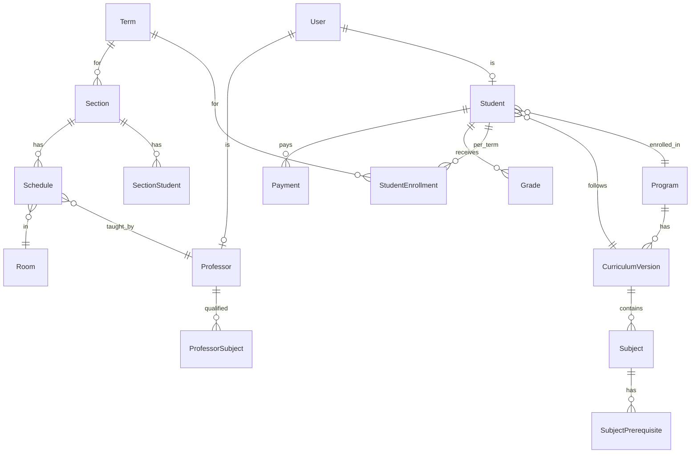

# Richwell Portal — Database Schema

> **Tech Stack:** Django + Django REST Framework + PostgreSQL
> **Models:** 18 total
> **Last Updated:** 2026-03-07

---

## Entity Relationship Overview



---

## 1. Authentication & Users

### `User`

Custom Django user model. All system actors share a single user table with role differentiation.

| Column | Type | Constraints | Notes |
|---|---|---|---|
| `id` | BigAutoField | PK | |
| `username` | CharField(50) | Unique, Required | Login credential |
| `password` | CharField(128) | Required | Django hashed password |
| `email` | EmailField | Unique, Required | |
| `first_name` | CharField(100) | Required | |
| `last_name` | CharField(100) | Required | |
| `role` | CharField(20) | Required | See choices below |
| `is_active` | BooleanField | Default: True | |
| `created_at` | DateTimeField | Auto | |
| `updated_at` | DateTimeField | Auto | |

**Role Choices:**

| Value | Description |
|---|---|
| `ADMIN` | System administrator |
| `HEAD_REGISTRAR` | Head Registrar (manages registrars + audit logs) |
| `REGISTRAR` | Registrar staff |
| `ADMISSION` | Admission office staff |
| `CASHIER` | Cashier / Finance |
| `DEAN` | Dean of the institution |
| `PROGRAM_HEAD` | Program Head (can manage multiple programs) |
| `PROFESSOR` | Faculty member |
| `STUDENT` | Student |

---

## 2. Academic Structure

### `Program`

An academic program offered by the institution.

| Column | Type | Constraints | Notes |
|---|---|---|---|
| `id` | BigAutoField | PK | |
| `code` | CharField(20) | Unique, Required | e.g., `BSIS`, `BECEd` |
| `name` | CharField(200) | Required | e.g., "BS in Information Systems" |
| `effective_year` | CharField(20) | Nullable | e.g., "2018-2019" |
| `has_summer` | BooleanField | Default: False | Whether program has summer subjects |
| `program_head` | ForeignKey(User) | Nullable, SET_NULL | Assigned Program Head |
| `is_active` | BooleanField | Default: True | |
| `created_at` | DateTimeField | Auto | |
| `updated_at` | DateTimeField | Auto | |

### `CurriculumVersion`

Versioned curriculum per program. Students are locked to a specific version at enrollment.

| Column | Type | Constraints | Notes |
|---|---|---|---|
| `id` | BigAutoField | PK | |
| `program` | ForeignKey(Program) | CASCADE | |
| `version_name` | CharField(50) | Required | e.g., "2018-2019" |
| `is_active` | BooleanField | Default: True | Active version for new enrollees |
| `created_at` | DateTimeField | Auto | |

**Unique:** `(program, version_name)`

### `Subject`

A subject within a curriculum version.

| Column | Type | Constraints | Notes |
|---|---|---|---|
| `id` | BigAutoField | PK | |
| `curriculum` | ForeignKey(CurriculumVersion) | CASCADE | |
| `code` | CharField(30) | Required | e.g., `CC113A` |
| `description` | CharField(300) | Required | e.g., "Introduction to Computing" |
| `year_level` | PositiveIntegerField | Required | 1–4 |
| `semester` | CharField(2) | Required | `1`, `2`, or `S` (Summer) |
| `lec_units` | PositiveIntegerField | Default: 0 | |
| `lab_units` | PositiveIntegerField | Default: 0 | |
| `total_units` | PositiveIntegerField | Required | `lec + lab` |
| `hrs_per_week` | DecimalField(4,1) | Nullable | Computed: total hours / 18 weeks |
| `is_major` | BooleanField | Default: False | Flagged as a major subject |
| `is_practicum` | BooleanField | Default: False | Excluded from scheduling |
| `created_at` | DateTimeField | Auto | |

**Unique:** `(curriculum, code)`
**Index:** `(curriculum, year_level, semester)`

### `SubjectPrerequisite`

Prerequisites for a subject. Supports specific-subject and standing-based types.

| Column | Type | Constraints | Notes |
|---|---|---|---|
| `id` | BigAutoField | PK | |
| `subject` | ForeignKey(Subject) | CASCADE | The subject that has this prereq |
| `prerequisite_type` | CharField(20) | Required | See choices below |
| `prerequisite_subject` | ForeignKey(Subject) | Nullable, SET_NULL | For `SPECIFIC` type |
| `standing_year` | PositiveIntegerField | Nullable | For `YEAR_STANDING` (e.g., 4) |
| `description` | CharField(200) | Nullable | Display text |

**Type Choices:**

| Value | Evaluation Logic |
|---|---|
| `SPECIFIC` | Student must have passed `prerequisite_subject` |
| `YEAR_STANDING` | All subjects ≤ `standing_year - 1` Year 2nd Sem must be passed |
| `ALL_MAJOR` | All `is_major=True` subjects must be passed |
| `PROGRAM_PERCENTAGE` | All subjects below current year level must be passed |

---

## 3. Term Management

### `Term`

An academic term with all configurable date ranges.

| Column | Type | Constraints | Notes |
|---|---|---|---|
| `id` | BigAutoField | PK | |
| `code` | CharField(10) | Unique, Required | e.g., `2027-1`, `2027-2`, `2027-S` |
| `academic_year` | CharField(20) | Required | e.g., "2027-2028" |
| `semester_type` | CharField(2) | Required | `1`, `2`, or `S` |
| `start_date` | DateField | Required | |
| `end_date` | DateField | Required | |
| `enrollment_start` | DateField | Required | |
| `enrollment_end` | DateField | Required | |
| `advising_start` | DateField | Required | |
| `advising_end` | DateField | Required | |
| `schedule_picking_start` | DateField | Nullable | |
| `schedule_picking_end` | DateField | Nullable | |
| `midterm_grade_start` | DateField | Nullable | |
| `midterm_grade_end` | DateField | Nullable | |
| `final_grade_start` | DateField | Nullable | |
| `final_grade_end` | DateField | Nullable | |
| `is_active` | BooleanField | Default: False | Only one active at a time |
| `created_at` | DateTimeField | Auto | |

---

## 4. Student Data

### `Student`

Extended student profile linked to User. Includes document checklist as JSON.

| Column | Type | Constraints | Notes |
|---|---|---|---|
| `id` | BigAutoField | PK | |
| `user` | OneToOneField(User) | CASCADE | |
| `idn` | CharField(10) | Unique, Required | e.g., `270001` |
| `middle_name` | CharField(100) | Nullable | |
| `date_of_birth` | DateField | Required | |
| `gender` | CharField(10) | Required | `MALE`, `FEMALE`, `OTHER` |
| `address_municipality` | CharField(100) | Required | From Bulacan location data |
| `address_barangay` | CharField(100) | Required | From Bulacan location data |
| `address_full` | TextField | Nullable | Full address string |
| `contact_number` | CharField(20) | Required | |
| `guardian_name` | CharField(200) | Required | |
| `guardian_contact` | CharField(20) | Required | |
| `program` | ForeignKey(Program) | PROTECT | |
| `curriculum` | ForeignKey(CurriculumVersion) | PROTECT | Locked at enrollment |
| `student_type` | CharField(15) | Required | `FRESHMAN`, `TRANSFEREE` |
| `status` | CharField(15) | Required | See choices below |
| `appointment_date` | DateField | Nullable | Set by Admission (optional) |
| `document_checklist` | JSONField | Default: `{}` | See structure below |
| `created_at` | DateTimeField | Auto | |
| `updated_at` | DateTimeField | Auto | |

**Status Choices:** `APPLICANT`, `APPROVED`, `REJECTED`, `ENROLLED`, `INACTIVE`, `GRADUATED`

**Document Checklist Structure:**
```json
{
  "F138": { "submitted": false, "verified": false },
  "PSA": { "submitted": true, "verified": false },
  "F137": { "submitted": true, "verified": true },
  "GOOD_MORAL": { "submitted": false, "verified": false },
  "PICTURE": { "submitted": true, "verified": true },
  "COG": { "submitted": false, "verified": false },
  "COR": { "submitted": false, "verified": false },
  "TOR": { "submitted": false, "verified": false },
  "HD": { "submitted": false, "verified": false },
  "CET": { "submitted": false, "verified": false }
}
```

### `StudentEnrollment`

Per-term enrollment record. Also holds advising approval status and monthly commitment.

| Column | Type | Constraints | Notes |
|---|---|---|---|
| `id` | BigAutoField | PK | |
| `student` | ForeignKey(Student) | CASCADE | |
| `term` | ForeignKey(Term) | CASCADE | |
| `advising_status` | CharField(15) | Default: `PENDING` | `PENDING`, `APPROVED`, `REJECTED` |
| `advising_approved_by` | ForeignKey(User) | Nullable, SET_NULL | Program Head |
| `advising_approved_at` | DateTimeField | Nullable | |
| `is_regular` | BooleanField | Default: True | Regular or irregular for this term |
| `monthly_commitment` | DecimalField(10,2) | Nullable | Payment commitment per month |
| `enrolled_by` | ForeignKey(User) | Nullable, SET_NULL | Admission staff |
| `enrollment_date` | DateTimeField | Auto | |

**Unique:** `(student, term)`

---

## 5. Sectioning

### `Section`

Auto-generated sections per program, year level, and term.

| Column | Type | Constraints | Notes |
|---|---|---|---|
| `id` | BigAutoField | PK | |
| `term` | ForeignKey(Term) | CASCADE | |
| `program` | ForeignKey(Program) | CASCADE | |
| `year_level` | PositiveIntegerField | Required | 1–4 |
| `section_number` | PositiveIntegerField | Required | 1, 2, 3... |
| `name` | CharField(30) | Required | e.g., `BSIS 1-1` |
| `session` | CharField(5) | Nullable | `AM`, `PM` |
| `max_students` | PositiveIntegerField | Default: 40 | Hard cap |
| `created_at` | DateTimeField | Auto | |

**Unique:** `(term, program, year_level, section_number)`

### `SectionStudent`

Student assignment to a section.

| Column | Type | Constraints | Notes |
|---|---|---|---|
| `id` | BigAutoField | PK | |
| `section` | ForeignKey(Section) | CASCADE | |
| `student` | ForeignKey(Student) | CASCADE | |
| `is_home_section` | BooleanField | Default: True | False = guest (irregular float) |
| `created_at` | DateTimeField | Auto | |

**Unique:** `(section, student)`

---

## 6. Scheduling

### `Schedule`

Professor → section → subject assignment with day and session.

| Column | Type | Constraints | Notes |
|---|---|---|---|
| `id` | BigAutoField | PK | |
| `term` | ForeignKey(Term) | CASCADE | |
| `section` | ForeignKey(Section) | CASCADE | |
| `subject` | ForeignKey(Subject) | CASCADE | |
| `professor` | ForeignKey(Professor) | CASCADE | |
| `room` | ForeignKey(Room) | Nullable, SET_NULL | |
| `days` | JSONField | Required | e.g., `["M","W","F"]` |
| `session` | CharField(5) | Required | `AM`, `PM`, `BOTH` |
| `created_at` | DateTimeField | Auto | |

**Unique:** `(term, section, subject)`

**Conflict checks (application-level):**
1. Professor conflict — same professor, same day+session, different section
2. Room conflict — same room, same day+session
3. Section conflict — same section, same day+session, different subject

---

## 7. Faculty

### `Professor`

Extended professor profile linked to User.

| Column | Type | Constraints | Notes |
|---|---|---|---|
| `id` | BigAutoField | PK | |
| `user` | OneToOneField(User) | CASCADE | |
| `employee_id` | CharField(20) | Unique, Required | Auto-generated or admin-input |
| `contact_number` | CharField(20) | Required | |
| `status` | CharField(10) | Default: `ACTIVE` | `ACTIVE`, `INACTIVE` |
| `created_at` | DateTimeField | Auto | |
| `updated_at` | DateTimeField | Auto | |

### `ProfessorSubject`

Which subjects a professor is qualified to teach.

| Column | Type | Constraints | Notes |
|---|---|---|---|
| `id` | BigAutoField | PK | |
| `professor` | ForeignKey(Professor) | CASCADE | |
| `subject` | ForeignKey(Subject) | CASCADE | |
| `assigned_by` | ForeignKey(User) | Nullable, SET_NULL | Registrar or Dean |
| `created_at` | DateTimeField | Auto | |

**Unique:** `(professor, subject)`

---

## 8. Grades

### `Grade`

**Serves quadruple duty:** advising record → grade record → credit record → resolution record.

| Column | Type | Constraints | Notes |
|---|---|---|---|
| `id` | BigAutoField | PK | |
| `student` | ForeignKey(Student) | CASCADE | |
| `subject` | ForeignKey(Subject) | CASCADE | |
| `term` | ForeignKey(Term) | CASCADE | |
| `section` | ForeignKey(Section) | Nullable, SET_NULL | Null during advising, set after sectioning |
| `is_retake` | BooleanField | Default: False | Student is retaking this subject |
| `is_credited` | BooleanField | Default: False | Transferee: credited from previous school |
| `midterm_grade` | CharField(10) | Nullable | Informational only |
| `final_grade` | CharField(10) | Nullable | Grade of record |
| `grade_status` | CharField(15) | Default: `ADVISING` | See choices below |
| `submitted_by` | ForeignKey(User) | Nullable, SET_NULL | Professor who submitted |
| `midterm_submitted_at` | DateTimeField | Nullable | |
| `final_submitted_at` | DateTimeField | Nullable | |
| `inc_deadline` | DateField | Nullable | 6mo (major) or 1yr (minor) from final |
| `finalized_by` | ForeignKey(User) | Nullable, SET_NULL | Registrar |
| `finalized_at` | DateTimeField | Nullable | |
| `resolution_status` | CharField(20) | Nullable | See resolution flow below |
| `resolution_new_grade` | CharField(10) | Nullable | New grade submitted for INC |
| `resolution_reason` | TextField | Nullable | Why the INC is being resolved |
| `resolution_requested_by` | ForeignKey(User) | Nullable, SET_NULL | Professor or Dean |
| `resolution_requested_at` | DateTimeField | Nullable | |
| `resolution_approved_by` | ForeignKey(User) | Nullable, SET_NULL | Final approver |
| `resolution_approved_at` | DateTimeField | Nullable | |
| `created_at` | DateTimeField | Auto | |
| `updated_at` | DateTimeField | Auto | |

**Unique:** `(student, subject, term)`

**Grade Status Choices — lifecycle of a Grade record:**

```
Normal:   ADVISING → ENROLLED → SUBMITTED → PASSED / INC / NO_GRADE / RETAKE → RESOLVED
Credited: ADVISING → PASSED (is_credited=True, skips enrollment/grading)
```

| Value | Description |
|---|---|
| `ADVISING` | Created during advising, pending approval |
| `ENROLLED` | Advising approved, student is enrolled in this subject |
| `SUBMITTED` | Professor submitted grade, pending finalization |
| `PASSED` | Student passed (1.0–3.0) |
| `INC` | Incomplete — countdown started |
| `NO_GRADE` | No grade submitted — auto-retake after deadline |
| `RETAKE` | Must retake the subject |
| `RESOLVED` | INC was resolved |

**Valid Grade Values:** `1.0`, `1.25`, `1.5`, `1.75`, `2.0`, `2.25`, `2.5`, `2.75`, `3.0`, `INC`, `NG`

**Resolution Status Flow (only for INC grades):**

```
PENDING_REGISTRAR → REGISTRAR_APPROVED → GRADE_SUBMITTED → PENDING_HEAD
    → HEAD_APPROVED → PENDING_FINAL → FINALIZED
    → HEAD_REJECTED → (professor re-submits) → PENDING_HEAD
```

---

## 9. Payments

### `Payment`

Monthly payment records processed by the Cashier.

| Column | Type | Constraints | Notes |
|---|---|---|---|
| `id` | BigAutoField | PK | |
| `student` | ForeignKey(Student) | CASCADE | |
| `term` | ForeignKey(Term) | CASCADE | |
| `month_number` | PositiveIntegerField | Required | 1–6 |
| `amount_paid` | DecimalField(10,2) | Required | |
| `is_promissory` | BooleanField | Default: False | |
| `payment_date` | DateTimeField | Auto | |
| `processed_by` | ForeignKey(User) | Nullable, SET_NULL | Cashier |
| `created_at` | DateTimeField | Auto | |

**Unique:** `(student, term, month_number)`

**Permit logic (derived from queries — no Permit table):**
- Month 1–2 paid → Subject Enrollment Permit ✓
- Month 3–4 paid → Midterm Exam Permit ✓
- Month 5–6 paid → Final Exam Permit ✓
- Month 1: Promissory always allowed
- Month 2+: Promissory only if previous month paid

---

## 10. Facilities

### `Room`

Physical rooms managed by Admin.

| Column | Type | Constraints | Notes |
|---|---|---|---|
| `id` | BigAutoField | PK | |
| `name` | CharField(50) | Unique, Required | e.g., "Room 101", "Lab 201" |
| `room_type` | CharField(15) | Required | `LECTURE`, `COMPUTER_LAB` |
| `capacity` | PositiveIntegerField | Required | |
| `is_active` | BooleanField | Default: True | |
| `created_at` | DateTimeField | Auto | |

---

## 11. Notifications

### `Notification`

In-system notifications (bell icon).

| Column | Type | Constraints | Notes |
|---|---|---|---|
| `id` | BigAutoField | PK | |
| `recipient` | ForeignKey(User) | CASCADE | |
| `title` | CharField(200) | Required | |
| `message` | TextField | Required | |
| `notification_type` | CharField(30) | Required | See types below |
| `is_read` | BooleanField | Default: False | |
| `link_url` | CharField(300) | Nullable | Deep link to page |
| `created_at` | DateTimeField | Auto | |

**Types:** `ADVISING_APPROVED`, `ADVISING_REJECTED`, `GRADE_SUBMITTED`, `GRADE_FINALIZED`, `INC_EXPIRING`, `INC_EXPIRED`, `RESOLUTION_REQUESTED`, `RESOLUTION_APPROVED`, `RESOLUTION_REJECTED`, `ENROLLMENT_APPROVED`, `ENROLLMENT_REJECTED`, `SCHEDULE_PUBLISHED`, `PAYMENT_RECORDED`, `SECTION_TRANSFER`

**Index:** `(recipient, is_read, created_at)`

---

## 12. Audit Trail

### `AuditLog`

Field-level audit log for all critical operations.

| Column | Type | Constraints | Notes |
|---|---|---|---|
| `id` | BigAutoField | PK | |
| `user` | ForeignKey(User) | Nullable, SET_NULL | Who performed the action |
| `action` | CharField(10) | Required | `CREATE`, `UPDATE`, `DELETE` |
| `model_name` | CharField(100) | Required | e.g., "Student", "Grade" |
| `object_id` | CharField(50) | Required | PK of affected record |
| `object_repr` | CharField(300) | Nullable | Human-readable representation |
| `field_changes` | JSONField | Nullable | `{"field": {"old": "X", "new": "Y"}}` |
| `ip_address` | GenericIPAddressField | Nullable | |
| `created_at` | DateTimeField | Auto | |

**Indexes:** `(user, created_at)`, `(model_name, object_id)`

**Visibility:** Admin sees all, Head Registrar sees Registrar logs, others see own.

---

## Model Summary

| # | Model | Records Per | Relationships |
|---|---|---|---|
| 1 | `User` | — | Base for all actors |
| 2 | `Program` | ~8 | → User (program_head) |
| 3 | `CurriculumVersion` | Per program | → Program |
| 4 | `Subject` | ~50 per curriculum | → CurriculumVersion |
| 5 | `SubjectPrerequisite` | Per subject | → Subject × 2 |
| 6 | `Term` | Per semester | Standalone |
| 7 | `Student` | Hundreds | → User, Program, CurriculumVersion |
| 8 | `StudentEnrollment` | Per student per term | → Student, Term |
| 9 | `Section` | Per program per year per term | → Term, Program |
| 10 | `SectionStudent` | Per student per section | → Section, Student |
| 11 | `Schedule` | Per section per subject | → Term, Section, Subject, Professor, Room |
| 12 | `Professor` | ~20 | → User |
| 13 | `ProfessorSubject` | Per professor per subject | → Professor, Subject |
| 14 | `Grade` | Per student per subject per term | → Student, Subject, Term, Section |
| 15 | `Payment` | Per student per month per term | → Student, Term |
| 16 | `Room` | ~10-20 | Standalone |
| 17 | `Notification` | Many | → User |
| 18 | `AuditLog` | Many | → User |

**Total: 18 models**
